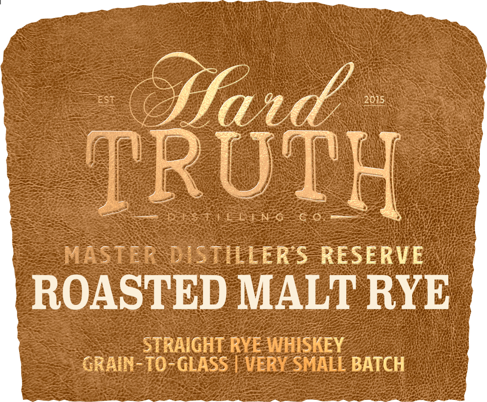
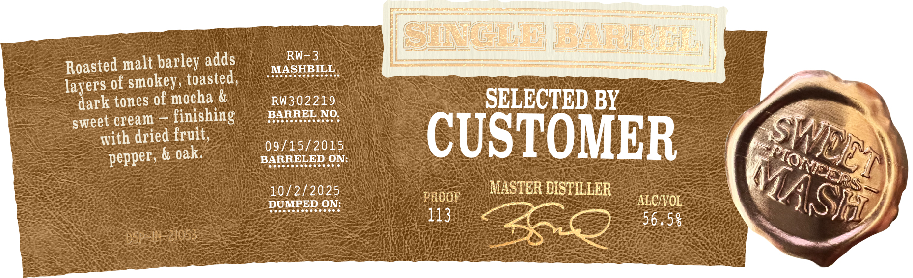

# TTB COLA Label Images - TTBID 26030001000405

**Brand Name:** HARD TRUTH DISTILLING CO.

**Issue Date:** 02/18/2026

**Origin Code:** 19

**Product Class/Type:** 102

**Source:** [TTB Public COLA Registry](https://ttbonline.gov/colasonline/viewColaDetails.do?action=publicFormDisplay&ttbid=26030001000405)

## Label Images

### Back Label

### Label 1

### Label 2

## Extracted Label Text

*Text extracted via OCR - may contain errors*

*2 image(s) excluded: text did not meet readability threshold*

### Label 2

Roasted malt barley adds Gas | Renaviwai e b BLEU SHC : =
layers of ped ot (MASHBIBE a
dark tones of mocha RW302219 m,
sweet cream — finishing RARREL.NO, SELECTED BY x A ™
cat CUSTOMER (7
peeks Saath este \
1 ; Vara (|
Sonne <a) MASTER DISTILLER | IA Gas
DUMPED ON: 1 ae Zoe SL
igh eee 565 © MOT
Rak eh —
