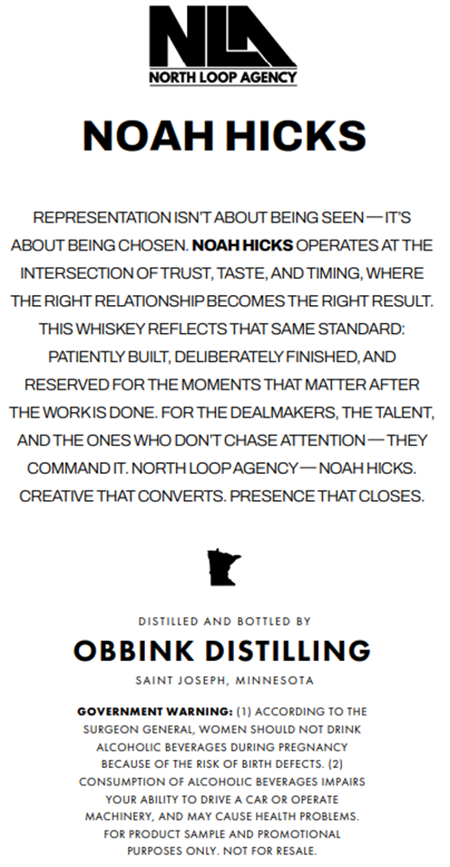
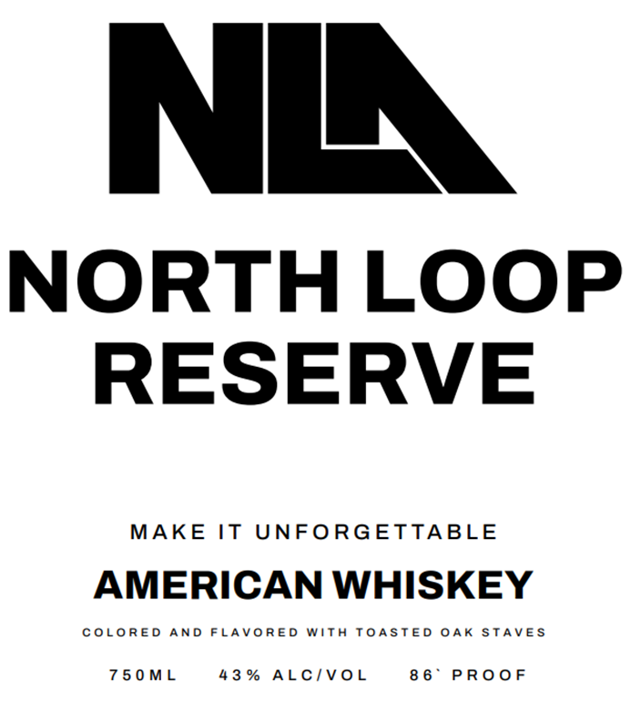

# TTB COLA Label Images - TTBID 26030001000406

**Brand Name:** OBBINK DISTILLING

**Fanciful Name:** NORTH LOOP RESERVE

**Issue Date:** 02/09/2026

**Origin Code:** 27

**Product Class/Type:** 140

**Source:** [TTB Public COLA Registry](https://ttbonline.gov/colasonline/viewColaDetails.do?action=publicFormDisplay&ttbid=26030001000406)

## Label Images

### Back Label

### Front Label

## Extracted Label Text

*Text extracted via OCR - may contain errors*

### Back Label

NIA.

NORTH LOOP AGENCY

NOAH HICKS

REPRESENTATION ISN'T ABOUT BEING SEEN— IT'S

ABOUT BEING CHOSEN. NOAH HICKS OPERATES AT THE

INTERSECTION OF TRUST, TASTE, AND TIMING, WHERE

THE RIGHT RELATIONSHIP BECOMES THE RIGHT RESULT.

THIS WHISKEY REFLECTS THAT SAME STANDARD:

PATIENTLY BUILT, DELIBERATELY FINISHED, AND

RESERVED FOR THE MOMENTS THAT MATTER AFTER

THE WORKIS DONE. FOR THE DEALMAKERS, THE TALENT,

AND THE ONES WHO DON'T CHASE ATTENTION — THEY

COMMAND IT. NORTH LOOPAGENCY — NOAH HICKS.

CREATIVE THAT CONVERTS. PRESENCE THAT CLOSES.

4

DISTILLED AND BOTTLED BY

OBBINK DISTILLING

SAINT JOSEPH, MINNESOTA

GOVERNMENT WARNING: (1) ACCORDING TO THE

SURGEON GENERAL, WOMEN SHOULD NOT DRINK

ALCOHOLIC BEVERAGES DURING PREGNANCY

BECAUSE OF THE RISK OF BIRTH DEFECTS. (2)

CONSUMPTION OF ALCOHOLIC BEVERAGES IMPAIRS

YOUR ABILITY TO DRIVE A CAR OR OPERATE

MACHINERY, AND MAY CAUSE HEALTH PROBLEMS,

FOR PRODUCT SAMPLE AND PROMOTIONAL

PURPOSES ONLY. NOT FOR RESALE

### Front Label

NORTH LOOP
RESERVE

MAKE IT UNFORGETTABLE

AMERICAN WHISKEY

COLORED AND FLAVORED WITH TOASTED OAK STAVES

750ML 43% ALC/VOL 86° PROOF
