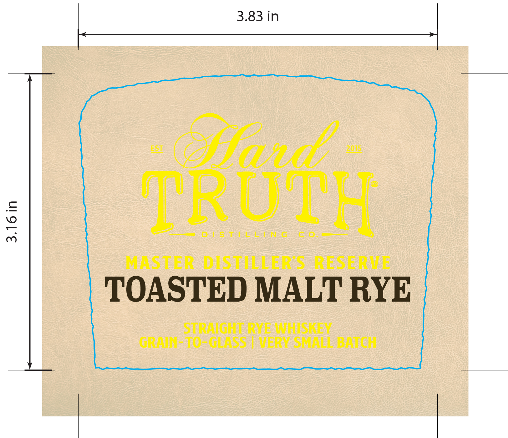
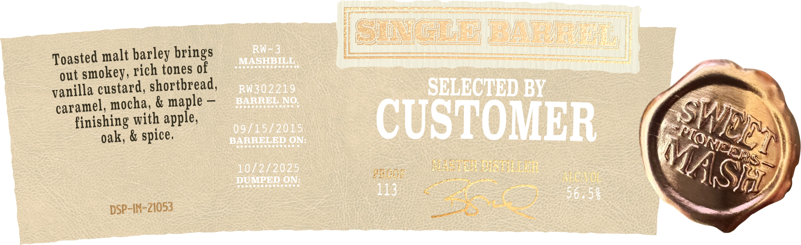

# TTB COLA Label Images - TTBID 26030001000532

**Brand Name:** HARD TRUTH DISTILLING CO.

**Issue Date:** 02/18/2026

**Origin Code:** 19

**Product Class/Type:** 102

**Source:** [TTB Public COLA Registry](https://ttbonline.gov/colasonline/viewColaDetails.do?action=publicFormDisplay&ttbid=26030001000532)

## Label Images

### Back Label

### Label 1

### Label 2

## Extracted Label Text

*Text extracted via OCR - may contain errors*

*1 image(s) excluded: text did not meet readability threshold*

### Label 1

MASTER DIS HELLER S RESERVE

TOASTED MALT RYE

STRAIGHT E WHISBLY
GRAIN- 10°GLASS7 VERT SMALL BATCH

### Label 2

Toasted malt barley brings i pe |
out smokey, rich tones of a
vanilla custard, shortbread, ie
caramel, mocha, & maple — >».
finishing with apple, m
oak, & spice. A s7)) DAS
Seat en etre eciaprar sets | Onna
DSP-IN-Z1053 See —— ‘ SVB
Canis <a aes SS - 2
