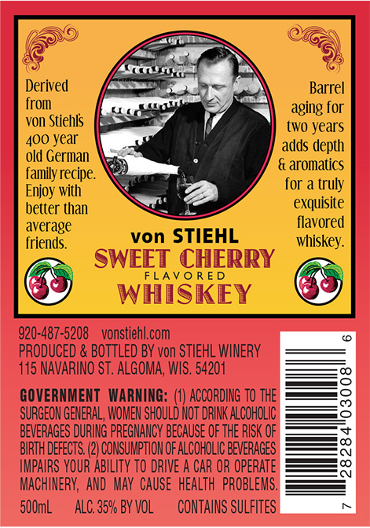
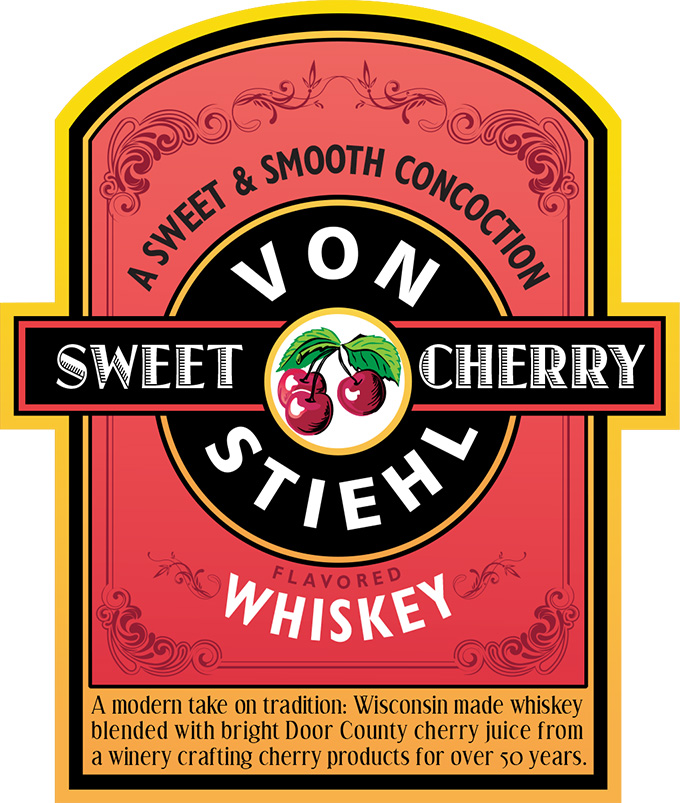

# TTB COLA Label Images - TTBID 26030001000536

**Brand Name:** VON STIEHL

**Issue Date:** 02/06/2026

**Origin Code:** 48

**Product Class/Type:** 149

**Source:** [TTB Public COLA Registry](https://ttbonline.gov/colasonline/viewColaDetails.do?action=publicFormDisplay&ttbid=26030001000536)

## Label Images

### Back Label

### Front Label

## Extracted Label Text

*Text extracted via OCR - may contain errors*

### Back Label

2)

Derived

Barrel

from

aging for

Von Stiehis

400 Year

two years

old German

adds depth

family recipe.

& aromatics

for a truly

Enjoy with

better than

exquisite

flavored

average

von STIEHL

friends.

whiskey.

Ss

S

y

ET CHERRY

LAVORE

WHISKEY

920-487-5208 _vonstiehl.com

PRODUCED & BOTTLED BY von STIEHL WINERY

115 NAVARINO ST. ALGOMA, WIS. 54201

GOVERNMENT WARNING: (1) ACCORDING 10 THE

SURGEON GENERAL, WOMEN SHOULD NOT DRINK ALCOHOLIC

BEVERAGES DURING PREGNANCY BECAUSE OF THE RISK OF

BIRTH DEFECTS. 2) CONSUMPTION OF ALCOHOLIC BEVERAGES

IMPAIRS YOUR ABILITY TO DRIVE A CAR OR OPERATE

MACHINERY, AND MAY CAUSE HEALTH PROBLEMS.

500mL

ALC. 35% BY VOL

CONTAINS SULFITES

### Front Label

SOnv

SWEET (7 ) CHERRY

wa I Ly

WHiskes
