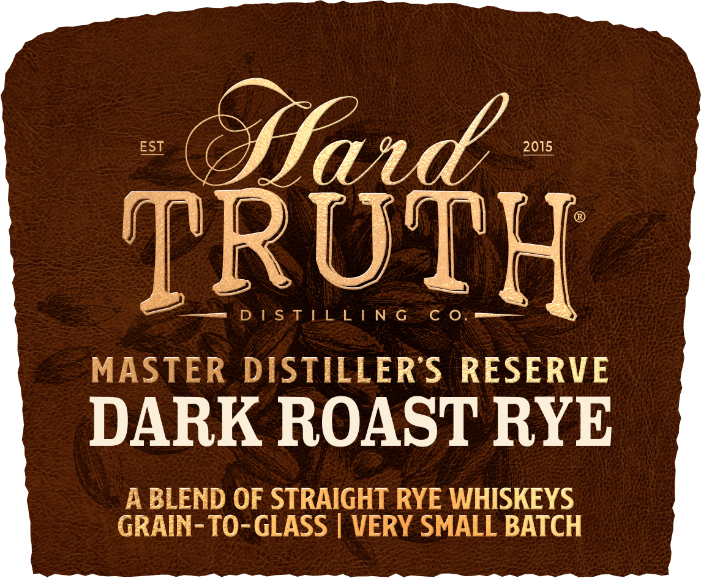
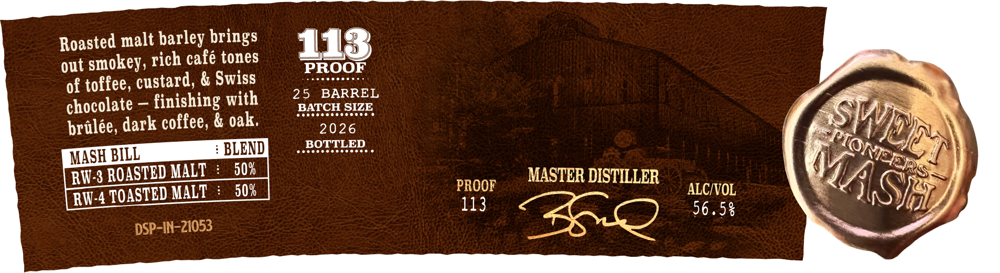

# TTB COLA Label Images - TTBID 26030001000553

**Brand Name:** HARD TRUTH DISTILLING CO.

**Issue Date:** 02/05/2026

**Origin Code:** 19

**Product Class/Type:** 122

**Source:** [TTB Public COLA Registry](https://ttbonline.gov/colasonline/viewColaDetails.do?action=publicFormDisplay&ttbid=26030001000553)

## Label Images

### Back Label

### Label 1

### Label 2

## Extracted Label Text

*Text extracted via OCR - may contain errors*

### Back Label

bss

—

ay

ae

a

5

=

a

—

coal

PS

Cy

7

sd

a

=

3

’,

.

-

=

i

-

ie

os

=

ad

—

ww

Pg

a

vv

Py

=

me:

.

.

4

ial

all

Bil

-_

-

=

i

——

Pl

oe

_

me

Me

4

ie

>

a

ks)

ad

Sad

2.

2

—_

a

is

—

a

p=

=

_

—

|

as

»

®

"i

2

fi

&

,

y |

od

e

=

apes

Pa

1

-

a

Pr

a

baal

/

|,

al

—

‘

a

“a

7

@

iy

sib

ad

eM

ra

-

A

r

ae

™

all

=

7

oo

TM

aa

we

“E

a

am

NV

\ |

be

a

!

q

=

bd

p

wa

uy)

aa

Lo

e--s

-- eS

Pears

ce

-

=]

2

### Label 1

EST

2015

TROT

DD SSsaF LL A | NGSe -O8

q

MASTER DISTILLER’'S RESERVE

DARK ROAST RYE

A BLEND OF STRAIGHT RYE WHISKEYS

GRAIN-TO-GLASS | VERY SMALL BATCH

### Label 2

Roasted malt barley brings

‘1

out smokey, rich café tones

PROOF

of toffee, custard, & Swiss

25 BARREL

chocolate — finishing with

Pretrertrererrny

BATCH SIZE

2026

As7;

g.

pralée, dark coffee, & oak.

BOTTLED

: BLEND

Prrererertrrrrti

Vic

SE ASTED MALT

MASTER DISTILLER

‘S

50%

PROOF

ALC/VOL

4

RW-4 TOASTED MALT :

113

O

AGA

1-7’

“AO 56.58
