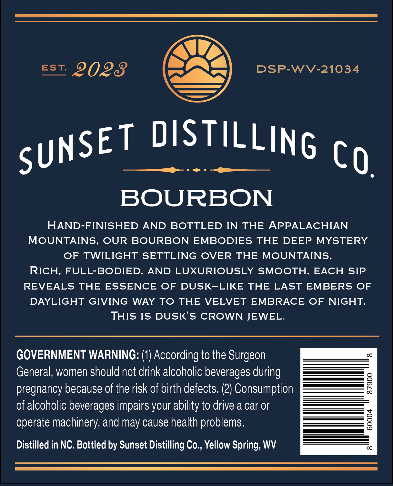
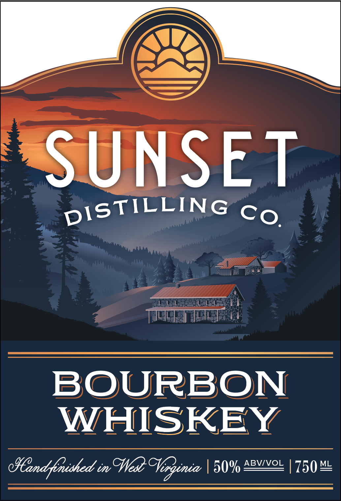

# TTB COLA Label Images - TTBID 26030001000598

**Brand Name:** SUNSET DISTILLING CO.

**Issue Date:** 02/17/2026

**Origin Code:** 47

**Product Class/Type:** 141

**Source:** [TTB Public COLA Registry](https://ttbonline.gov/colasonline/viewColaDetails.do?action=publicFormDisplay&ttbid=26030001000598)

## Label Images

### Back Label

### Front Label

## Extracted Label Text

*Text extracted via OCR - may contain errors*

### Back Label

DSP-WV-21034

Est. DOD

ome

BOURBON

HAND-FINISHED AND BOTTLED IN THE APPALACHIAN

MOUNTAINS, OUR BOURBON EMBODIES THE DEEP MYSTERY

OF TWILIGHT SETTLING OVER THE MOUNTAINS.

RICH, FULL-BODIED, AND LUXURIOUSLY SMOOTH, EACH SIP

REVEALS THE ESSENCE OF DUSK-LIKE THE LAST EMBERS OF

DAYLIGHT GIVING WAY TO THE VELVET EMBRACE OF NIGHT.

THIS IS DUSK’S CROWN JEWEL.

GOVERNMENT WARNING: (1) According to the Surgeon

General, women should not drink alcoholic beverages during

a

_eS

—

pregnancy because of the risk of birth defects. (2) Consumption

of alcoholic beverages impairs your ability to drive a car or

operate machinery, and may cause health problems.

Distilled in NC. Bottled by Sunset Distilling Co., Yellow Spring, WV

### Front Label

“SUNSET

pISTILLING cg

oe,

Te a:

BOURBON

WHISKEY

Hiendfonished in Wes Tenginia | 50% Se | 750)
