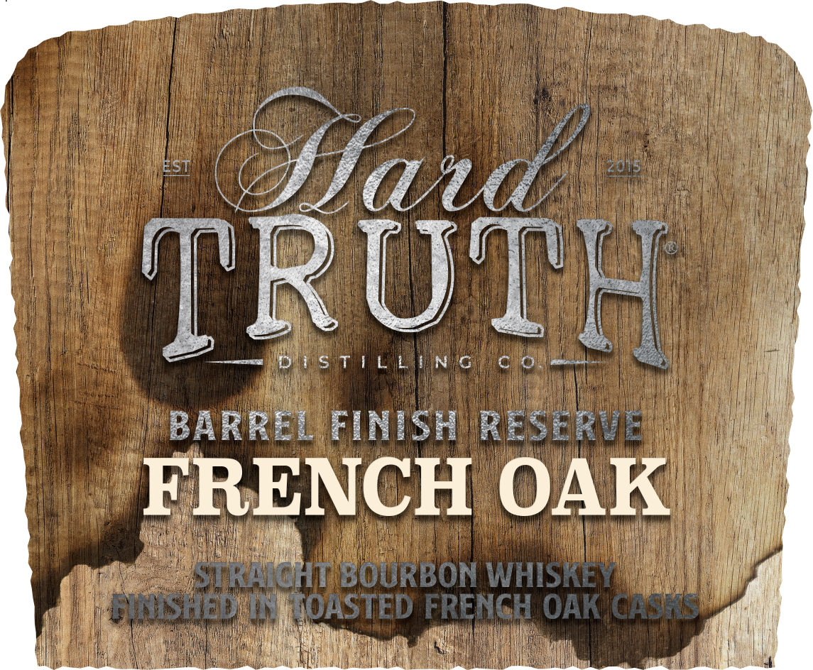
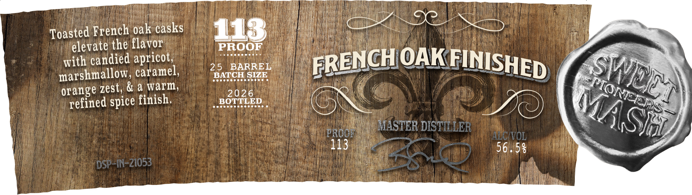

# TTB COLA Label Images - TTBID 26030001000646

**Brand Name:** HARD TRUTH DISTILLING CO.

**Issue Date:** 02/09/2026

**Origin Code:** 19

**Product Class/Type:** 101

**Source:** [TTB Public COLA Registry](https://ttbonline.gov/colasonline/viewColaDetails.do?action=publicFormDisplay&ttbid=26030001000646)

## Label Images

### Back Label

### Label 1

### Label 2

## Extracted Label Text

*Text extracted via OCR - may contain errors*

*2 image(s) excluded: text did not meet readability threshold*

### Label 2

bint

i

=<

eee

roasted French

oak casks

jjielévate the flavor |

with candiéd apricot,

25 BARRE

OA

eet nell eral we

marshmallow, caramel,

desevecees

BATCH $)

a

orange zest, & a warm,

BOTTLED.

this

refined spice finish.

Peco rrrry

Y)

iO)

ud

RO

Pip,

561/53 :
