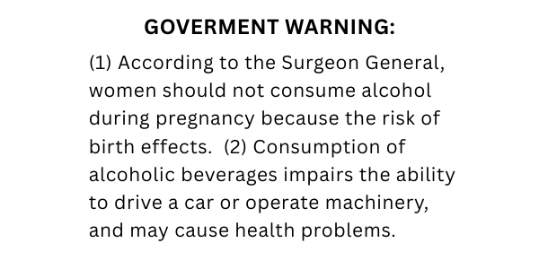
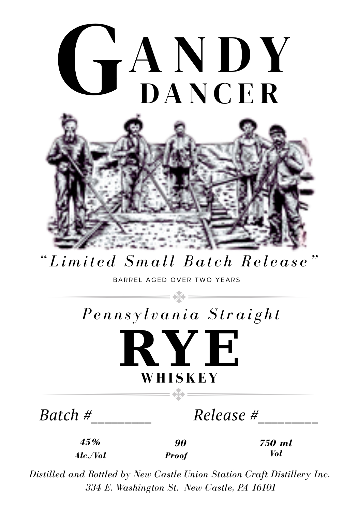

# TTB COLA Label Images - TTBID 26031001000031

**Brand Name:** GANDY DANCER

**Issue Date:** 02/12/2026

**Origin Code:** 39

**Product Class/Type:** 102

**Source:** [TTB Public COLA Registry](https://ttbonline.gov/colasonline/viewColaDetails.do?action=publicFormDisplay&ttbid=26031001000031)

## Label Images

### Back Label

### Front Label

## Extracted Label Text

*Text extracted via OCR - may contain errors*

### Back Label

GOVERMENT WARNING:

(1) According to the Surgeon General,

women should not consume alcohol

during pregnancy because the risk of

birth effects. (2) Consumption of

alcoholic beverages impairs the ability

to drive a car or operate machinery,

and may cause health problems.

### Front Label

ANDY

DANCER

2.

— yy"

peg he

~—

as

is

4-

t-

¥

Le

«&

uA

bc/

fy

“i

=

i)

Pe.

Aw

—

we Tae

ae

Se

“Limited Small Batch Release’

BARREL AGED OVER TWO YEARS

Pennsylvania Straight

RYE

WHISKEY

Batch #

————

Release #

———_—__—

45%

90

750 ml

Ale./Vol

Vol

Proof

Distilled and Bottled by New Castle Union Station Craft Distillery Inc

334 FE. Washington St. New Castle, PA 16101
