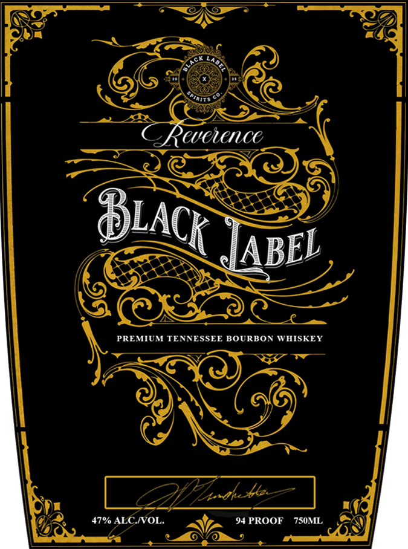

# TTB COLA Label Images - TTBID 26031001000090

**Brand Name:** REVERENCE

**Fanciful Name:** BLACK LABEL

**Issue Date:** 02/05/2026

**Origin Code:** 43

**Product Class/Type:** 141

**Source:** [TTB Public COLA Registry](https://ttbonline.gov/colasonline/viewColaDetails.do?action=publicFormDisplay&ttbid=26031001000090)

## Label Images

### Front Label

## Extracted Label Text

*Text extracted via OCR - may contain errors*

### Front Label

<= S NS

74,

ea

XS HKiceS

oF)

a

AE,

RUWOONCE

(

Be

gohS

SSS

@)

LAC

Seas

we)

ys

ABEL

<2

= C £

——

PREMIUM TENNESSEE BOURBON WHISKEY

~~

pa

A

Gy.

©

“7% ALGIVOL.

a)

Y

@ NS}

94 PROOF ML

A)
