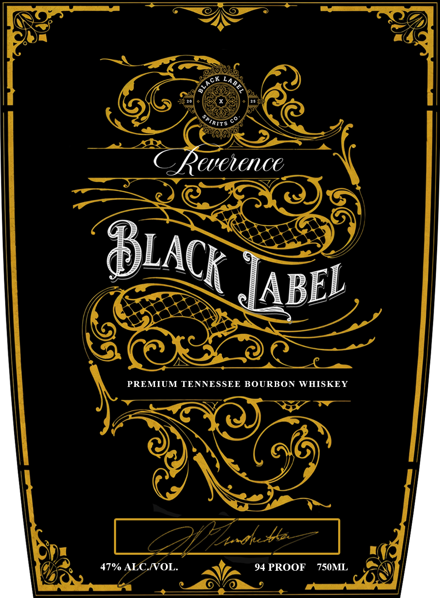

# TTB COLA Label Images - TTBID 26031001000091

**Brand Name:** REVERENCE

**Fanciful Name:** BLACK LABEL

**Issue Date:** 02/05/2026

**Origin Code:** 43

**Product Class/Type:** 141

**Source:** [TTB Public COLA Registry](https://ttbonline.gov/colasonline/viewColaDetails.do?action=publicFormDisplay&ttbid=26031001000091)

## Label Images

### Front Label

## Extracted Label Text

*Text extracted via OCR - may contain errors*

### Front Label

Cy

=e)

a(g\

WH

em

fs

“LS —_ a

—

SS ar

NG!

ASS

VEX y

Se

iL

vA

[ABEL

ES

SS

——.

—<“

PREMIUM TENNESSEE BOURBON WHISKEY

Y NY

LI

px

Drath ble - | ag

4AT% MENOL.

t,

94PROOF 750ML is)

an

a,
