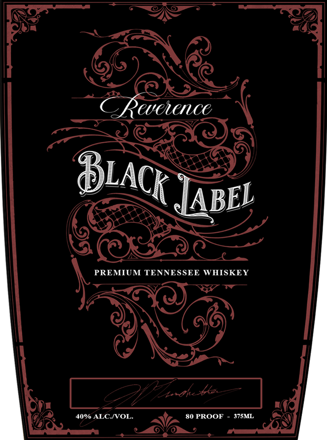

# TTB COLA Label Images - TTBID 26031001000092

**Brand Name:** REVERENCE

**Fanciful Name:** BLACK LABEL

**Issue Date:** 02/06/2026

**Origin Code:** 43

**Product Class/Type:** 140

**Source:** [TTB Public COLA Registry](https://ttbonline.gov/colasonline/viewColaDetails.do?action=publicFormDisplay&ttbid=26031001000092)

## Label Images

### Front Label

## Extracted Label Text

*Text extracted via OCR - may contain errors*

### Front Label

GL

a)

Fy)

Wey

ea

—~\_ oF,

5G,

Q)

al a SN

{

ac

BLAC

Yi

ABEL

oe)

yee

—

PREMIUM TENNESSEE WHISKEY

whet

Gx,

pe

80 PROOF -

4

40% weno

OES

Z
