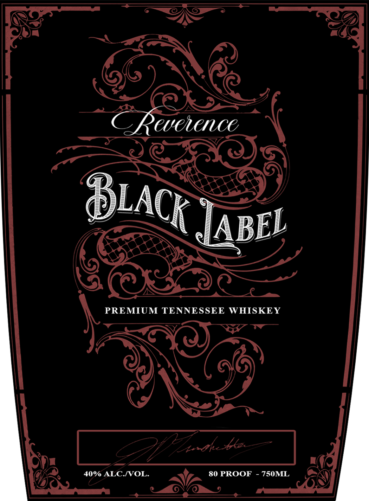

# TTB COLA Label Images - TTBID 26031001000093

**Brand Name:** REVERENCE

**Fanciful Name:** BLACK LABEL

**Issue Date:** 02/05/2026

**Origin Code:** 43

**Product Class/Type:** 140

**Source:** [TTB Public COLA Registry](https://ttbonline.gov/colasonline/viewColaDetails.do?action=publicFormDisplay&ttbid=26031001000093)

## Label Images

### Front Label

## Extracted Label Text

*Text extracted via OCR - may contain errors*

### Front Label

Ua

—~ wt,

LD

QP)

=y NY

C Pocrnce

pe

LA

Tan

EL

Jara

PREMIUM TENNESSEE WHISKEY

—

ar —$N7

a7

Z Cnoth pe

Dt

AG

©

40% ALC./VOL.

aN

VA 80 PROOF - 750ML

aN)
