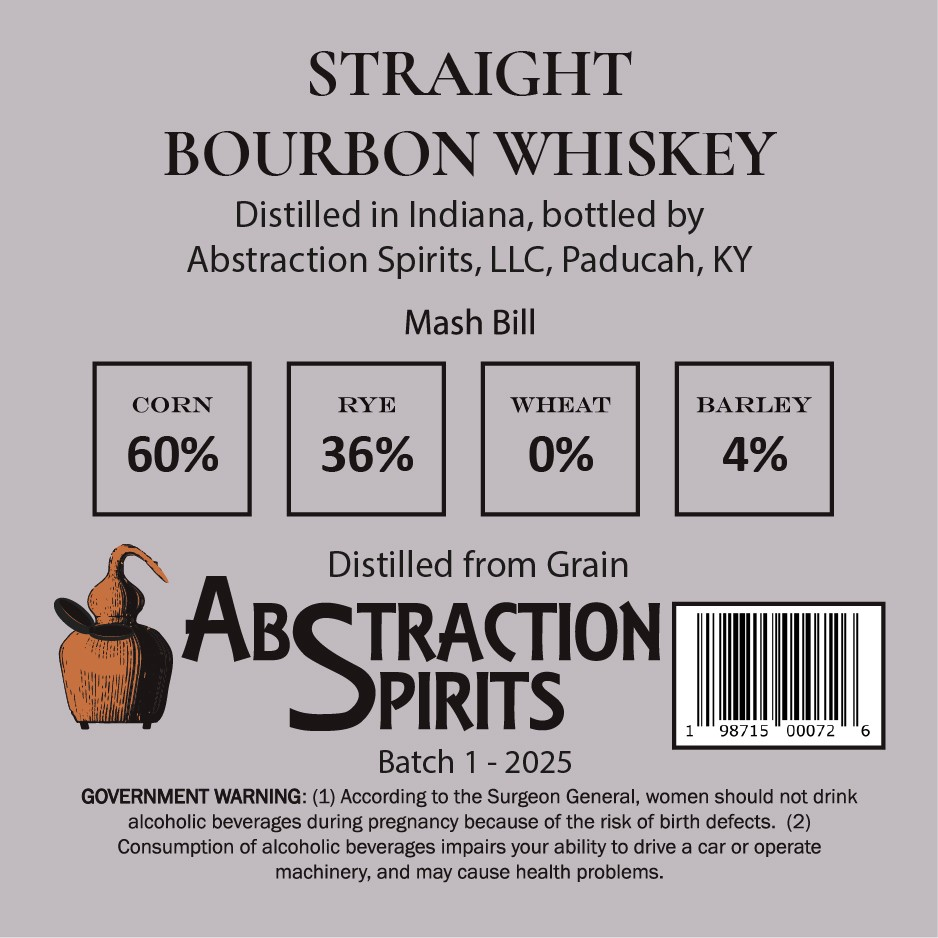
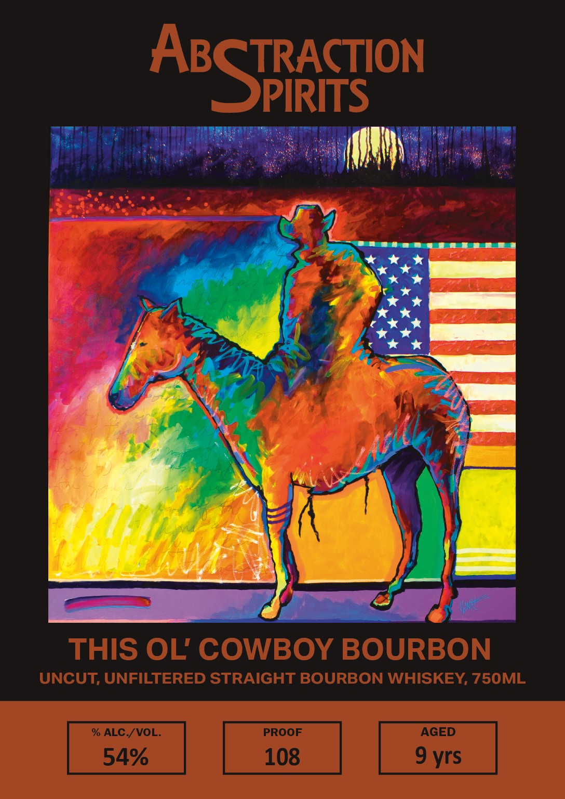

# TTB COLA Label Images - TTBID 26032001000089

**Brand Name:** ABSTRACTION SPIRITS

**Fanciful Name:** THIS OL COWBOY

**Issue Date:** 02/05/2026

**Origin Code:** 22

**Product Class/Type:** 101

**Source:** [TTB Public COLA Registry](https://ttbonline.gov/colasonline/viewColaDetails.do?action=publicFormDisplay&ttbid=26032001000089)

## Label Images

### Back Label

### Front Label

## Extracted Label Text

*Text extracted via OCR - may contain errors*

*1 image(s) excluded: text did not meet readability threshold*

### Back Label

STRAIGHT

BOURBON WHISKEY

Distilled in Indiana, bottled by

Abstraction Spirits, LLC, Paducah, KY

Mash Bill

CORN

RYE

BARLEY

60%

36%

4%

os |

Distilled from Grain

TRACTION

|

As

PIRITS

98715 00072

6

Batch 1 - 2025

GOVERNMENT WARNING: (1) According to the Surgeon General, women should not drink

alcoholic beverages during pregnancy because of the risk of birth defects. (2)

Consumption of alcoholic beverages impairs your ability to drive a car or operate

machinery, and may cause health problems.
