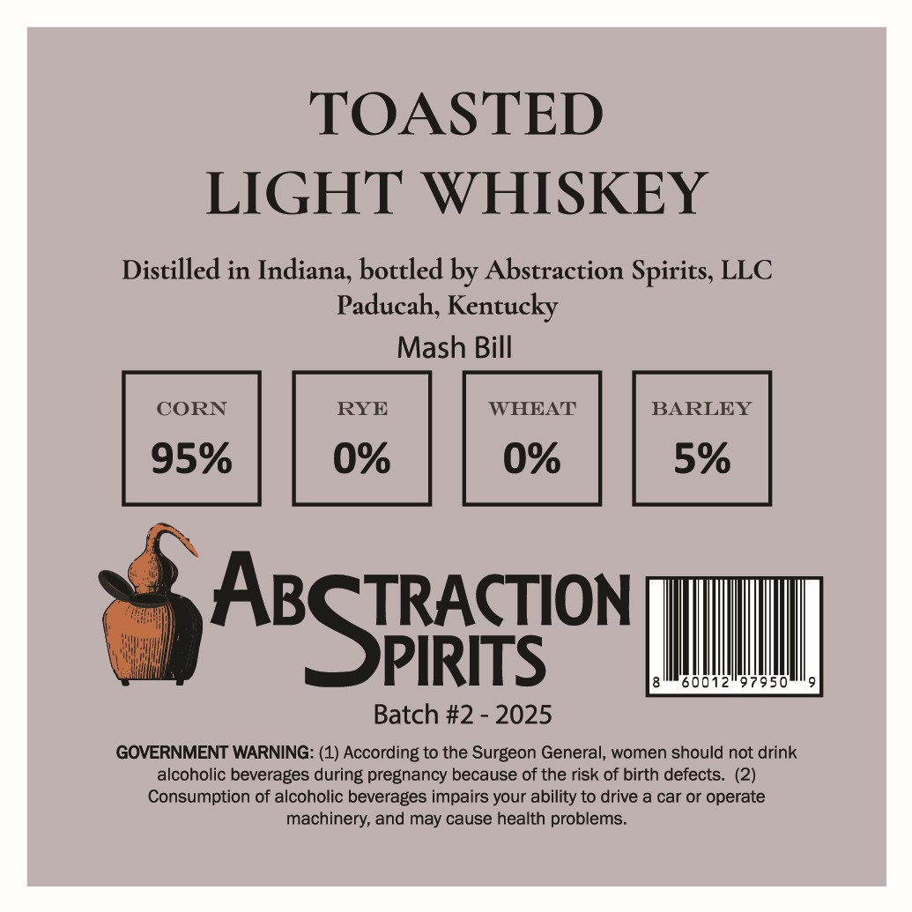
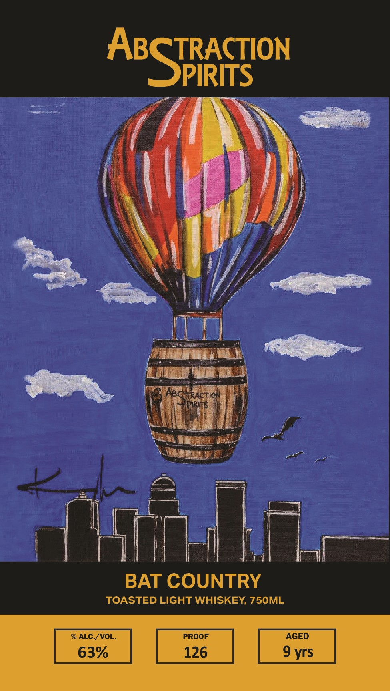

# TTB COLA Label Images - TTBID 26032001000092

**Brand Name:** ABSTRACTION SPIRITS LLC

**Fanciful Name:** BAT COUNTRY

**Issue Date:** 02/12/2026

**Origin Code:** 22

**Product Class/Type:** 144

**Source:** [TTB Public COLA Registry](https://ttbonline.gov/colasonline/viewColaDetails.do?action=publicFormDisplay&ttbid=26032001000092)

## Label Images

### Back Label

### Front Label

## Extracted Label Text

*Text extracted via OCR - may contain errors*

### Back Label

TOASTED
LIGHT WHISKEY

Distilled in Indiana, bottled by Abstraction Spirits, LLC
Paducah, Kentucky

Mash Bill

 AscrRaction
PIRITS | MII,

Batch #2 - 2025

GOVERNMENT WARNING: (1) According to the Surgeon General, women should not drink
alcoholic beverages during pregnancy because of the risk of birth defects. (2)
Consumption of alcoholic beverages impairs your ability to drive a car or operate
machinery, and may cause health problems.

### Front Label

ABGIRACTION

Nicer

}

Y

nd

y

(Eee

i,

ier

7a aes

Pte

| oF

Sih

bl

nal

ites ne: ye

Mm 2

ath i, os

BAT COUNTRY

TOASTED LIGHT WHISKEY, 750ML

a

63%
