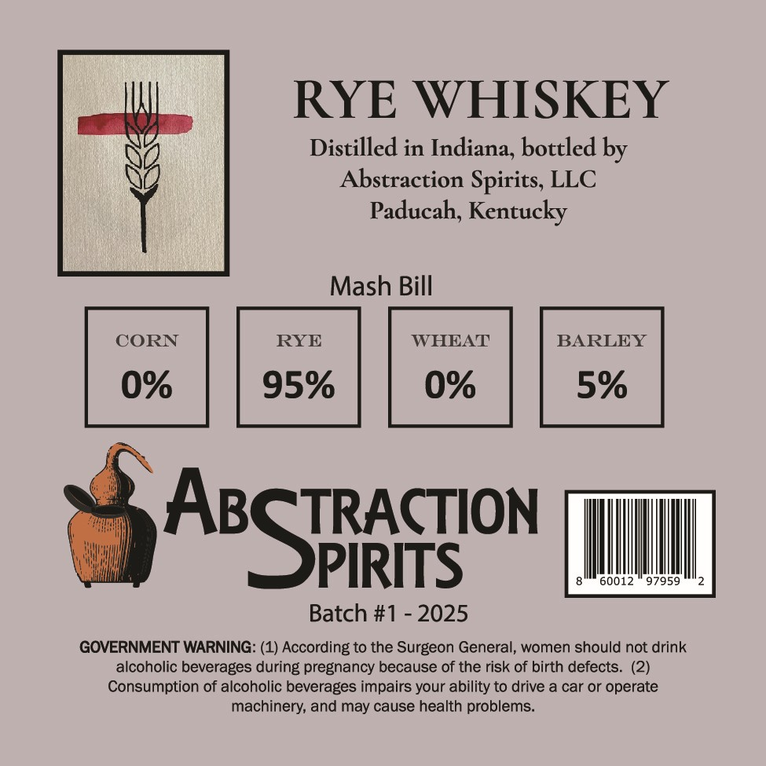
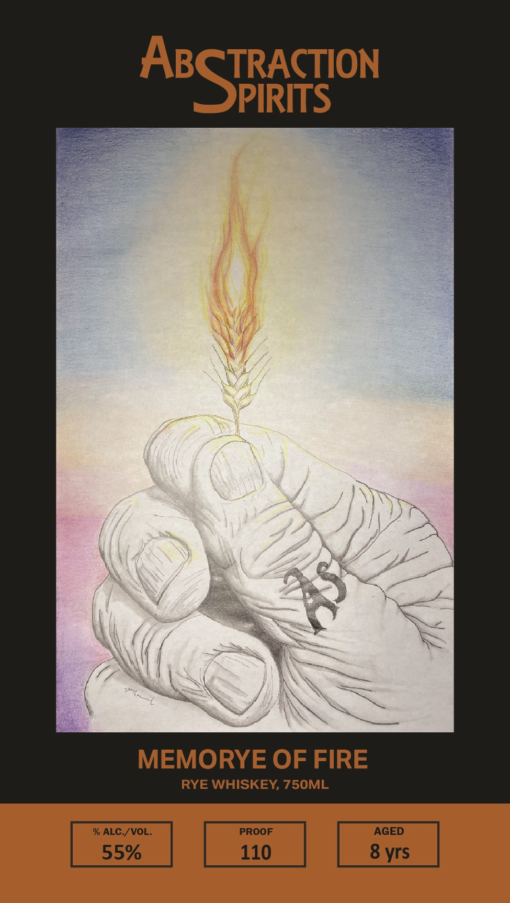

# TTB COLA Label Images - TTBID 26032001000094

**Brand Name:** ABSTRACTION SPIRITS LLC

**Fanciful Name:** MEMORYE OF FIRE

**Issue Date:** 02/12/2026

**Origin Code:** 22

**Product Class/Type:** 142

**Source:** [TTB Public COLA Registry](https://ttbonline.gov/colasonline/viewColaDetails.do?action=publicFormDisplay&ttbid=26032001000094)

## Label Images

### Back Label

### Front Label

## Extracted Label Text

*Text extracted via OCR - may contain errors*

### Back Label

RYE WHISKEY

Distilled in Indiana, bottled by

NA

NI

Abstraction Spirits, LLC

Paducah, Kentucky

Mash Bill

CORN

0%

TRACTION

|

4A

'S

PIRITS

60012" 97959

Batch #1 - 2025

GOVERNMENT WARNING: (1) According to the Surgeon General, women should not drink

alcoholic beverages during pregnancy because of the risk of birth defects. (2)

Consumption of alcoholic beverages impairs your ability to drive a car or operate

machinery, and may cause health problems.

### Front Label

TRACTION

ABS

PIRITS

“Se.

“\

—

MEMORYE OF TE

RYE WHISKEY, 750ML
