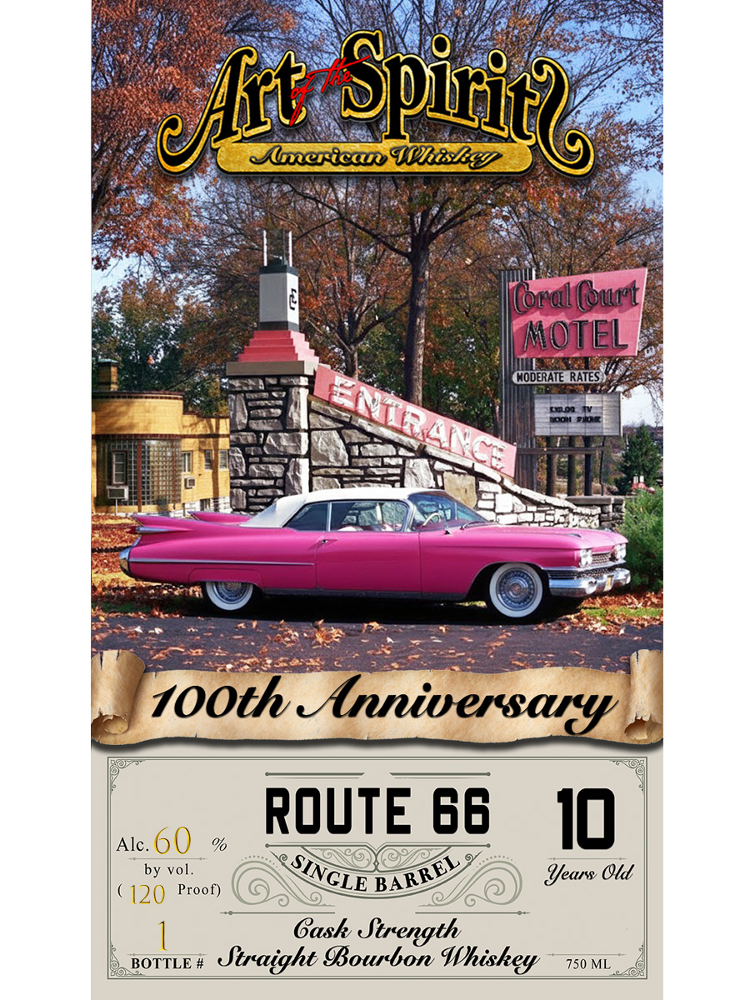

# TTB COLA Label Images - TTBID 26032001000146

**Brand Name:** ART OF THE SPIRITS AMERICAN WHISKEY

**Fanciful Name:** 100TH ANNIVERSARY

**Issue Date:** 02/05/2026

**Origin Code:** 13

**Product Class/Type:** 101

**Source:** [TTB Public COLA Registry](https://ttbonline.gov/colasonline/viewColaDetails.do?action=publicFormDisplay&ttbid=26032001000146)

## Label Images

### Back Label

### Front Label

## Extracted Label Text

*Text extracted via OCR - may contain errors*

### Back Label

iba er NV sew)
4) FY WW |
J 5 ror. 2016 2 ili cm Yl
In 2026, America’s iconic Route 66 - theye MotherpROadsatitaty
linked Chicago to Los Angeles - marks its10UtHAMMIVersaty9
a centennial celebration of its designationpinpl)20fandgits)
enduring place:in U.S. culture and travellorewAcross the
ight States it Crosses, COmmunities are planning events that
; barra 1 SS ae
Honorgthesroad:srdeep Historygandavtite mythology trom
Classic car shows to,concertssparades; and centennial markerss
Missourisplaysea spotlight roles Springtieldys officially
recognized as the “Birthplace of Route 662; wherein 1926
local businessmenshelpedschampion,the new. highway-s name.
alg is theNftiomanCenemmialkitkoftin April
thri’May, featuring Concerts parades, ivetereaientions
assic Car showsmart walks, and festivals that spotlightboth
Route Ov orem and Le usar sue 1 a Mean d=
sian ForRoute Goifams-and road=trip lovers, Missouri-sey
Centenmiabevents lend nee bingeomMunity prdecinde :
ie e Sicha a a as
fins lta ugacude gt Bs
WW. WEEADICT'O F TSHGEES PaTERSISLeSesGsO =v
~ GOVERNMENT WARNING: (1) ACCORDING TOTHE SURGEON | | ie
}.. GENERAL. WOMEN SHOULD NOT DRINK ALCOHOLIC as
: > BEVERAGES DURING PREGNANCY BECAUSE OF THE RISK OF =
S AATEC AOR os
BEVERAGES IMPAIRS YOUR ABILITY TO DRIVEA CAR OR =|
OPERATE MACHINERY. AND MAY CAUSE HEALTH PROBLEMS.
ae Distiedsin Indiand > Sees
Bottledeby Arbofthe-Spirits Whiskey an:Colorado; Springs? Colorado<:

### Front Label

PRON ted ele iad ON NESBA A NE BORE Sete of amy
ee ae! UNO 1G Pi ape:
Resi Seay bs fog HO) (NEO

Mes (ey ae ORL Ea
gee e Wiliilegy- . aa

gee eo ROE AN T Btoe ae Rs ae
eae Bat ee fa AMER on ane
gee es eS Na oe ON aS de:

[Pere ee Ss Ree ee ye
ee E Sul eset ml Vine ieee tone.

Bee Bee sep i fo ‘
i Preys a Be Wvoverare tates Cocos

om 3s Ae? = iN
ee a |
na SIGs ee Se
aa, yyy age fe
Sc’ | he Poe EE eae
3S : aioe fs

Se

eer ©) Ss

er SS a spears Se

Mae er ee aie

AOS eegeeae Co cee ae ee 8c

" -

)700th rsa |

—————————SE—E

ROUTE 66

Ale.OQ % vy 10
pv | EXAXOGICZ Gy .

(420) Proof) \( G \ ele BABE’ 6) Years Old

| | Cash Strength

norms Straight Bourbon Whishey —ys0vi 1
