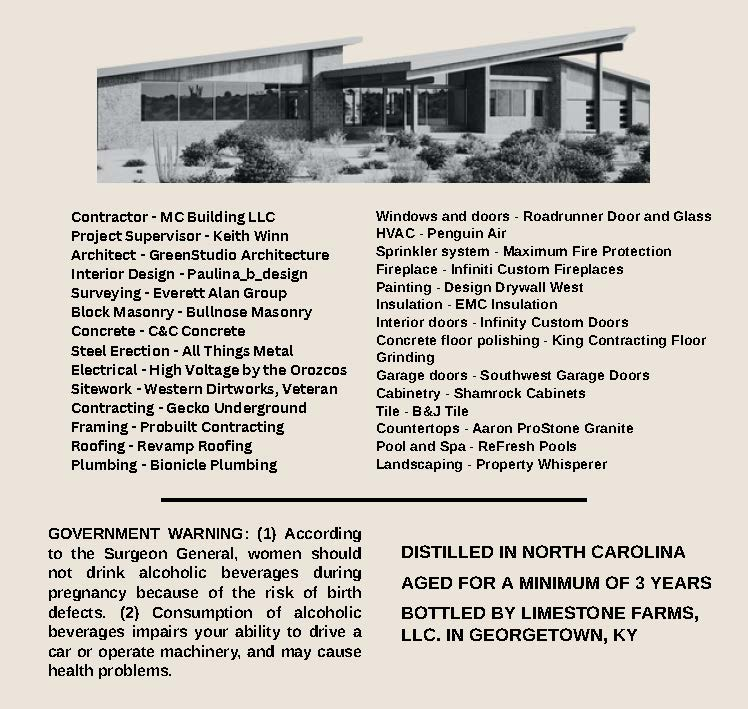
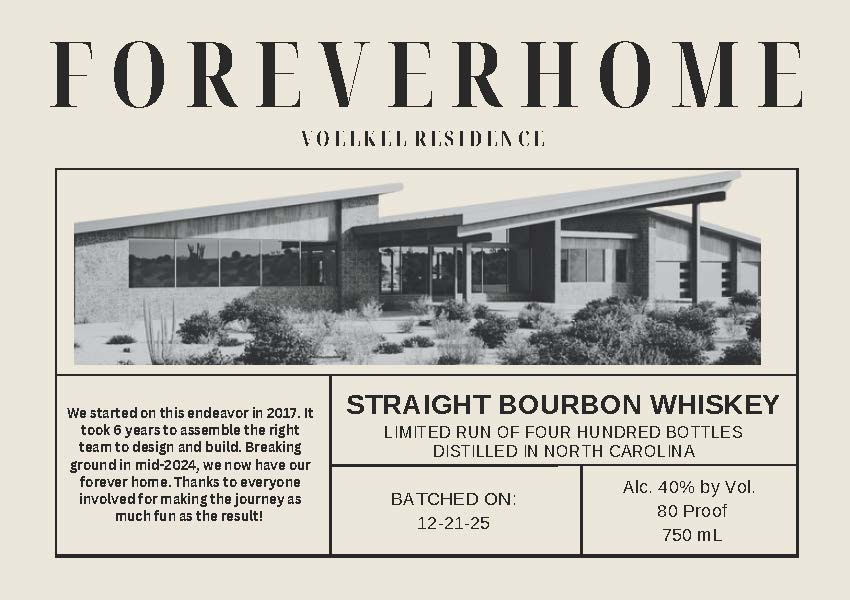

# TTB COLA Label Images - TTBID 26033001000056

**Brand Name:** FOREVER HOME

**Issue Date:** 02/05/2026

**Origin Code:** 22

**Product Class/Type:** 101

**Source:** [TTB Public COLA Registry](https://ttbonline.gov/colasonline/viewColaDetails.do?action=publicFormDisplay&ttbid=26033001000056)

## Label Images

### Back Label

### Front Label

## Extracted Label Text

*Text extracted via OCR - may contain errors*

### Back Label

Nabe

Contractor - MC Building LLC

Project Supervisor - Keith Winn
Architect - GreenStudio Architecture
Interior Design - Paulina b_design
Surveying - Everett Alan Group

Block Masonry - Bullnose Masonry
Concrete - C&C Concrete

Steel Erection - All Things Metal
Electrical - High Voltage by the Orozcas
sitework - Western Dirtworks, Veteran
Contracting - Gecko Underground
Framing - Probuilt Contracting
Roofing - Revamp Roofing

Plumbing - Bionicle Plumbing

Windows and doors - Roadrunner Door and Glass.
HVAC - Penguin Air

Sprinkler system - Maximum Fire Protection
Fireplace - Infiniti Custom Fireplaces

Painting - Design Drywall West

Insulation - EMC Insulation

Interior doors - Infinity Custom Doors

Conerete floor polishing - King Contracting Floor
Grinding

Garage doors - Southwest Garage Doors
Cabinetry - Shamrock Cabinets

Tile - B&J Tile

Countertops - Aaron ProStone Granite

Pool and Spa - ReFresh Pools

Landscaping - Property Whisperer

GOVERNMENT WARNING: (1} According
to the Surgeon General, women should
not drink alcoholic beverages during
pregnancy because of the risk of birth
defects. (2) Consumption of alcoholic
beverages impairs your ability to drive a
car or operate machinery, and may cause
health problems.

DISTILLED IN NORTH CAROLINA
AGED FOR A MINIMUM OF 3 YEARS

BOTTLED BY LIMESTONE FARMS,
LLC. IN GEORGETOWN, KY

### Front Label

FOREVERHOME

VOLLKEL RESIDENCE

—

me cee = ber

7

y

2

ie

=

ff

Hd:

H

int

ab

b 3

an,

aie

ins

he

We started on this endeavor in 2017. It

STRAIGHT BOURBON WHISKEY

took 6 yearsto assemble the right

LIMITED RUN OF FOUR HUNDRED BOTTLES

team to design and build, Breaking

DISTILLED IN NORTH CAROLINA

groundin mid-2024, we now have our

forever home. Thanks to everyone

Alc. 40% by Vol

involved for making the journey as

BATCHED ON

80 Proof

much fun as the result!

42-21-25

750 mL
