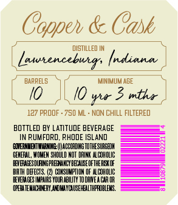
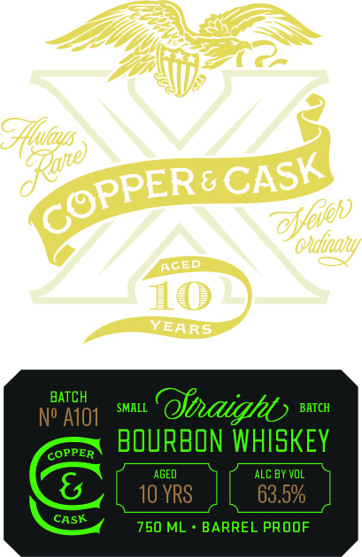

# TTB COLA Label Images - TTBID 26033001000060

**Brand Name:** COPPER & CASK

**Issue Date:** 02/05/2026

**Origin Code:** 40

**Product Class/Type:** 101

**Source:** [TTB Public COLA Registry](https://ttbonline.gov/colasonline/viewColaDetails.do?action=publicFormDisplay&ttbid=26033001000060)

## Label Images

### Back Label

### Front Label

### Label 3

## Extracted Label Text

*Text extracted via OCR - may contain errors*

### Back Label

Cooper & Cok

DISTILLED IN

L, Lawrenceburg

frdinna, |

F

BARRELS

MINIMUM ABE

I

0,

\

10 rar 3 wither |

127 PROOF +780 ML - NON CHILL FILTERED

BOTTLED BY LATITUDE BEVERAGE

———<)

IN RUMFORD, RHODE ISLAND

SOENETNN (CCG TTHESUBEH

—F

GERERL, WOMEN SHOULD NOT ORIN ALCHOUC

(EVGES TANG PREAMCY BEANE OTHERS OF

—

RTH FECTS. (2) COMSIMTION OF wLcHOLC

EVES MPS YOUR ABILITY TODRWEA CRO

CPE TEACHER NOME PRES,

——4

### Front Label

BATCH at Oy

BATCH

——x BOURBON WHISKEY

I oo>=e a ooo"

ASK

[oves } [bax

S

750 ML + BARREL PROOF

### Label 3

Li) |
