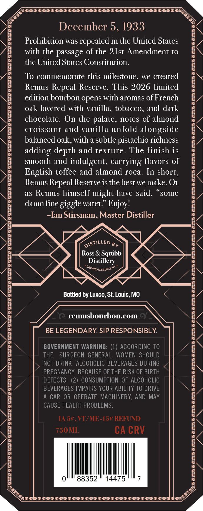
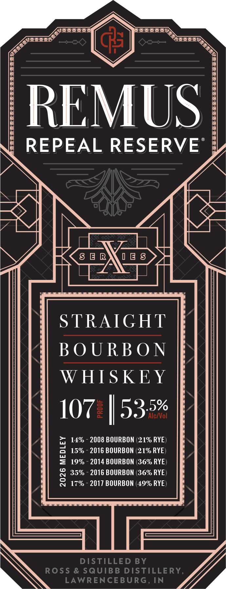

# TTB COLA Label Images - TTBID 26033001000104

**Brand Name:** REMUS

**Issue Date:** 02/05/2026

**Origin Code:** 29

**Product Class/Type:** 101

**Source:** [TTB Public COLA Registry](https://ttbonline.gov/colasonline/viewColaDetails.do?action=publicFormDisplay&ttbid=26033001000104)

## Label Images

### Back Label

### Front Label

### Label 3

## Extracted Label Text

*Text extracted via OCR - may contain errors*

### Back Label

GMETETATTTCCECACACAAAAAAARARARARAARARAYD 7

y 6

o>

December 5, 1933

Prohibition was repealed in the United States

with the passage of the 21st Amendment to

the United States Constitution

To commemorate this milestone, we created

Remus Repeal Reserve. This 2026 limited

edition bourbon opens with aromas of French

oak layered with vanilla, tobacco, and dark

chocolate. On the palate, notes of almond

croissant and vanilla unfold alongside

balanced oak, with a subtle pistachio richness

adding depth and texture. The finish is

smooth and indulgent, carrying flavors of

English toffee and almond roca. In short.

Remus Repeal Reserve is the best we make. Or

as Remus himself might have said

some

damn fine giggle water.” Enjoy!

-Ian Stirsman, Master Distiller

GISTILLED g

Ross & Squibb

Distillery

<

Smenceaune™

\?

G4

>

<

Bottled by Luxco, St. Louis, MO

remusbourbon.com

BE LEGENDARY. SIP RESPONSIBLY.

GOVERNMENT WARNING: (1) ACCORDING TO

THE SURGEON GENERAL, WOMEN SHOULD

NOT DRINK ALCOHOLIC BEVERAGES DURING

PREGNANCY BECAUSE OF THE RISK OF BIRTH

DEFECTS

(2) CONSUMPTION OF ALCOHOLIC

BEVERAGES IMPAIRS YOUR ABILITY TO DRIVE

A CAR OR OPERATE MACHINERY, AND MAY

CAUSE HEALTH PROBLEMS

[A 5¢

VI/ME-15¢ REFUND

750MI

CACRV

A

-

88352

14475

Re,

vy

£

> ‘ene I IVVWIYLIVVIII III I GVO YAS oy

“i

### Front Label

WGI

iN

MUS

|

= REPEAL RESERVE :

%

VN

> |

Mf

IM]

| }

“AQ

STRAIGHT

BOURBON

WHISKEY

ali

OUR

\N

WJ

### Label 3

SNS NNO ZN NN XO

aSicy

SON Y

2%

hoo

St

PLN

Ione

CTE

ak

Rag

Ava

BN OXS

Sw

SS

Soe

RE

SHE LS

PER

REPEAL

SERIES

Ss

x

ry

Sor

SS

aS SACI wet A

RS

x

as

Cg

LN

SES. eS; ae

xe

RF

RS

OSS

&

Ry

Rr

RASS

VO Fn VU VS a
