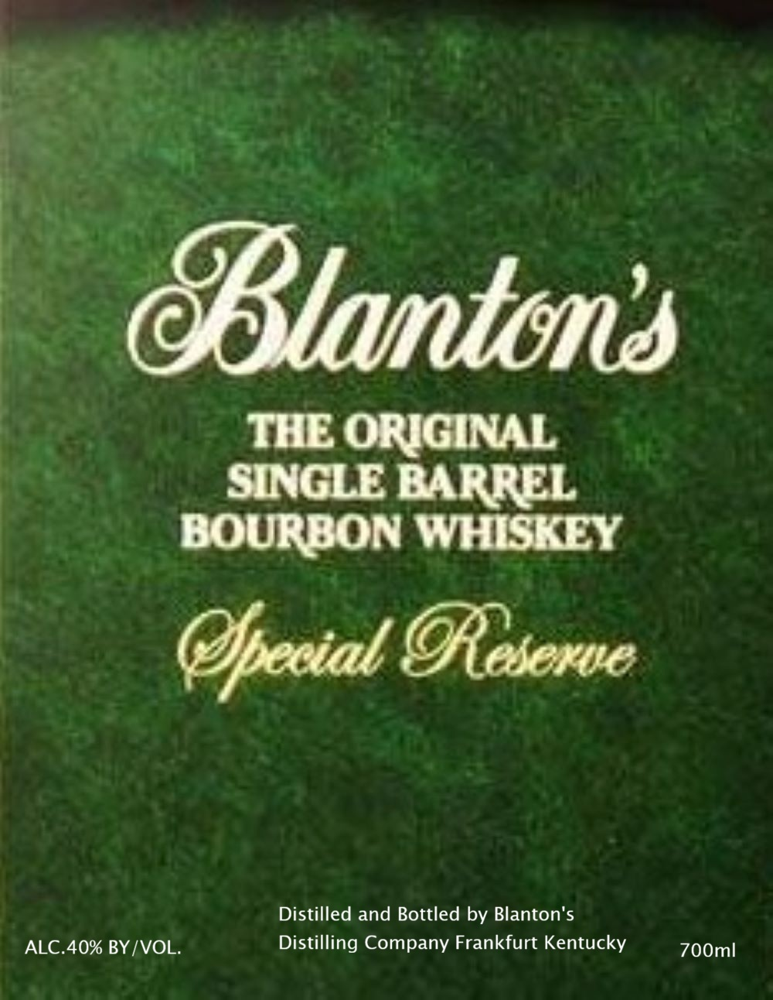
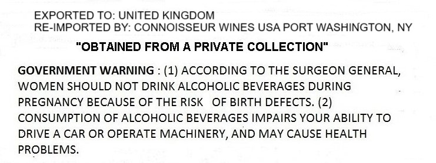

# TTB COLA Label Images - TTBID 26033001000126

**Brand Name:** BLANTON'S

**Fanciful Name:** SPECIAL RESERVE

**Issue Date:** 02/05/2026

**Origin Code:** 00

**Product Class/Type:** 141

**Source:** [TTB Public COLA Registry](https://ttbonline.gov/colasonline/viewColaDetails.do?action=publicFormDisplay&ttbid=26033001000126)

## Label Images

### Back Label

### Label 2

## Extracted Label Text

*Text extracted via OCR - may contain errors*

### Back Label

THE ORIGINAL

BOURBON WHISKEY

Special Reserve

Distilled and Bottled by Blanton's

ALC.40% BY/VOL.

Distilling Company Frankfurt Kentucky

700mlI

### Label 2

EXPORTED TO: UNITED KINGDOM

RE-IMPORTED BY: CONNOISSEUR WINES USA PORT WASHINGTON, NY

“OBTAINED FROM A PRIVATE COLLECTION"

GOVERNMENT WARNING : (1) ACCORDING TO THE SURGEON GENERAL,

WOMEN SHOULD NOT DRINK ALCOHOLIC BEVERAGES DURING

PREGNANCY BECAUSE OF THE RISK OF BIRTH DEFECTS. (2)

CONSUMPTION OF ALCOHOLIC BEVERAGES IMPAIRS YOUR ABILITY TO

DRIVE A CAR OR OPERATE MACHINERY, AND MAY CAUSE HEALTH

PROBLEMS.
