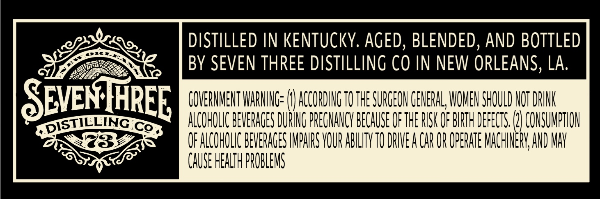
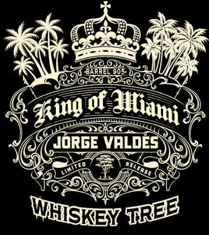
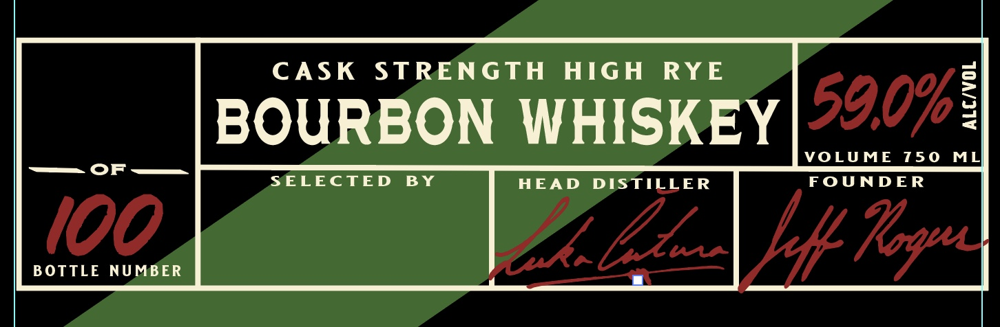

# TTB COLA Label Images - TTBID 26033001000157

**Brand Name:** WHISKEY TREE

**Fanciful Name:** KING OF MIAMI BARREL 905

**Issue Date:** 02/06/2026

**Origin Code:** 23

**Product Class/Type:** 141

**Source:** [TTB Public COLA Registry](https://ttbonline.gov/colasonline/viewColaDetails.do?action=publicFormDisplay&ttbid=26033001000157)

## Label Images

### Back Label

### Front Label

### Label 2

## Extracted Label Text

*Text extracted via OCR - may contain errors*

*1 image(s) excluded: text did not meet readability threshold*

### Back Label

ope, | DISTILLED IN KENTUCKY. AGED, BLENDED, AND BOTTLED
EN « BY SEVEN THREE DISTILLING CO IN NEW ORLEANS, LA.
SEVENTHREE, COVERNENT WARNING (1) ACCORDING TO THE SURGEON CENERAL WOMEN SHOULD NOT DRINK
PRE TILLING cemeee UCHLI BEVERAGES DURING PREGNANCY BECAUSE OF HE RISK OF BATH ERECT ()CONSUMATON
po Reet OF ALCOHOLIC BEVERAGES IMPAIRS YOUR ABILTYTO DRIVE CAR OR OPERATE MACHINERY AND MAY
OS™ CAUSE HEATH PROBLEMS

### Label 2

CASK STRENGTH HIGH RYE 590%:
BOURBON WHISKEY |0."”:

ial SELECTED BY HEAD DISTILLER FOUNDER
"
