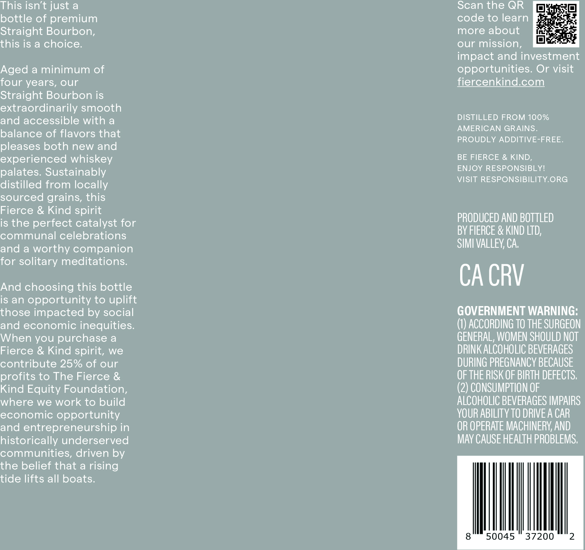
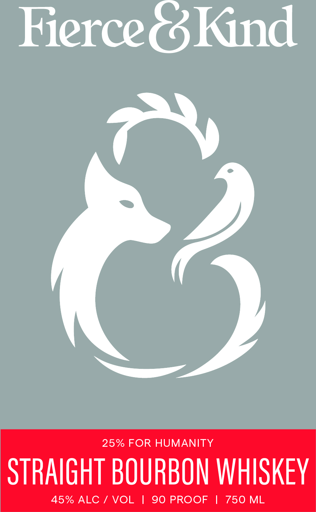

# TTB COLA Label Images - TTBID 26033001000311

**Brand Name:** FIERCE & KIND

**Issue Date:** 02/06/2026

**Origin Code:** 01

**Product Class/Type:** 101

**Source:** [TTB Public COLA Registry](https://ttbonline.gov/colasonline/viewColaDetails.do?action=publicFormDisplay&ttbid=26033001000311)

## Label Images

### Back Label

### Front Label

## Extracted Label Text

*Text extracted via OCR - may contain errors*

*1 image(s) excluded: text did not meet readability threshold*

### Back Label

This isn’t just a

Scan the QR [fq

bottle of premium

code to learn

Straight Bourbon,

more about

mle

this is a choice.

our mission,

impact and investment

Aged a minimum of

opportunities. Or visit

four years, our

fiercenkind.com

Straight Bourbon is

and accessible with a

extraordinarily smooth

DISTILLED FROM 100%

AMERICAN GRAINS.

balance of flavors that

PROUDLY ADDITIVE-FREE.

pleases both new and

experienced whiskey

BE FIERCE & KIND,

palates. Sustainably

ENJOY RESPONSIBLY!

distilled from locally

VISIT RESPONSIBILITY.ORG

sourced grains, this

Fierce & Kind spirit

PRODUCED AND BOTTLED

communal celebrations

is the perfect catalyst for

BY FIERCE & KIND LTD,

SIMI VALLEY, CA.

and a worthy companion

for solitary meditations.

And choosing this bottle

CA CRV

is an opportunity to uplift

those impacted by social

GOVERNMENT WARNING:

and economic inequities.

(1) ACCORDING TO THE SURGEON

GENERAL, WOMEN SHOULD NOT

When you purchase a

DRINK ALCOHOLIC BEVERAGES

Fierce & Kind spirit, we

contribute 25% of our

DURING PREGNANCY BECAUSE

profits to The Fierce &

OF THE RISK OF BIRTH DEFECTS.

Kind Equity Foundation,

(2) CONSUMPTION OF

where we work to build

ALCOHOLIC BEVERAGES IMPAIRS

economic opportunity

YOUR ABILITY TO DRIVE A CAR

and entrepreneurship in

OR OPERATE MACHINERY, AND

historically underserved

MAY CAUSE HEALTH PROBLEMS.

communities, driven by

the belief that a rising

tide lifts all boats.

ill.
