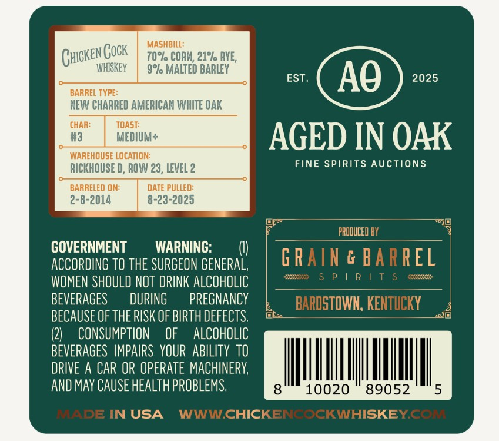

# TTB COLA Label Images - TTBID 26033001000376

**Brand Name:** CHICKEN COCK

**Issue Date:** 02/19/2026

**Origin Code:** 22

**Product Class/Type:** 140

**Source:** [TTB Public COLA Registry](https://ttbonline.gov/colasonline/viewColaDetails.do?action=publicFormDisplay&ttbid=26033001000376)

## Label Images

### Back Label

## Extracted Label Text

*Text extracted via OCR - may contain errors*

### Back Label

MASHBILL:

(ick

EN COCK

WHISKEY

70°o CORN, 21° RYE,

9° MALTED BARLEY

HEW CHARRED AMERICAN WHITE OAK

CHAR:

TOAST:

#3

MEDIUM

WAREHOUSE LOCATION:

AGED IN OAK

RICKHOUSE D, ROW 23, LEVEL 2

FINE SPIRITS AUCTIONS

2-8-2014

BARRELED ON:

DATE PULLED:

8-23-2025

=

or

=

RO

Uc

GOVERNMENT

WARNING:

i)

ACCORDING TO THE SURGEON GENERAL,

n

WOMEN SHOULD NOT DRINK ALCOHOLIC

J)

BEVERAGES

DURING

PREGNANCY

BECAUSE OF THE RISK OF BIRTH DEFECTS.

ha

—

Q)

CONSUMPTION OF ALCOHOLIC

BEVERAGES IMPAIRS YOUR ABILITY TO

DRIVE A CAR OR OPERATE MACHINERY,

AND MAY CAUSE HEALTH PROBLEMS.

IR

1 USA

qc
