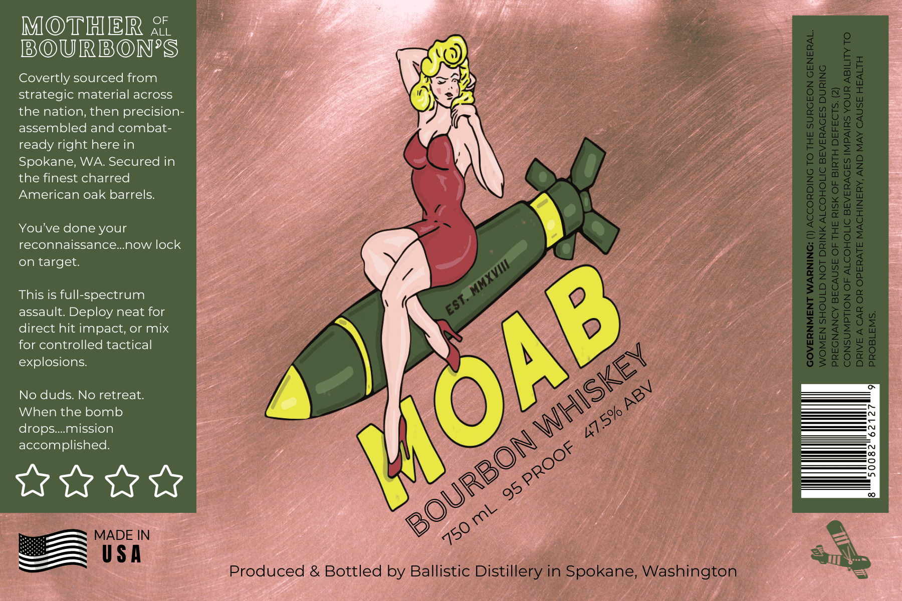

# TTB COLA Label Images - TTBID 26033001000421

**Brand Name:** BALLISTIC DISTILLERY

**Issue Date:** 02/06/2026

**Origin Code:** 07

**Product Class/Type:** 141

**Source:** [TTB Public COLA Registry](https://ttbonline.gov/colasonline/viewColaDetails.do?action=publicFormDisplay&ttbid=26033001000421)

## Label Images

### Label 1

## Extracted Label Text

*Text extracted via OCR - may contain errors*

### Label 1

OF

MOTHER

ALL

EXOUUIRIBO)NES

ae

Covertly sourced from

Y

strategic material across

the nation, then precision-

assembled and combat-

ty

Cs

ready right here in

c

Spokane, WA. Secured in

the finest charred

American oak barrels.

gee

You've done your

3

reconnaissance...now lock

on target.

This is full-spectrum

assault. Deploy neat for

direct hit impact, or mix

for controlled tactical

explosions.

7

No duds. No retreat.

\)

When the bomb

fi

Pe

drops.... mission

accomplished.

a

aie

Cex

wey ayy

a

we

ore

ot

ee

ed

sok

=——

#

ae
