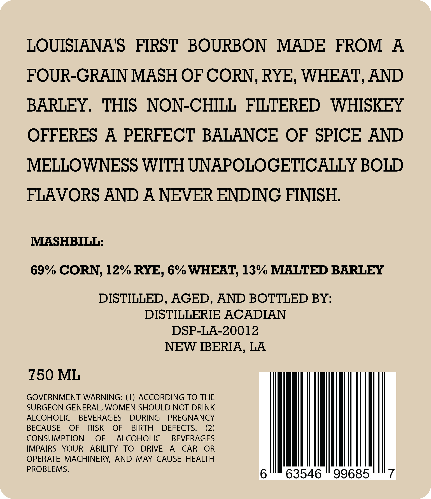
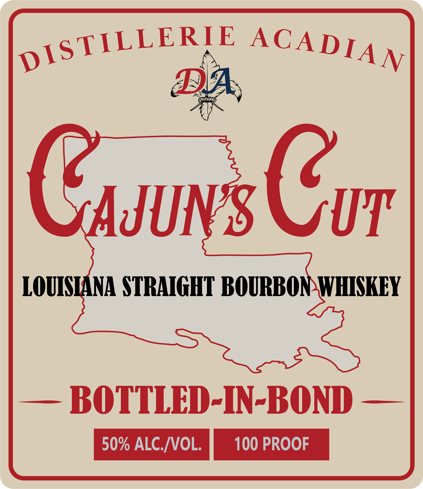
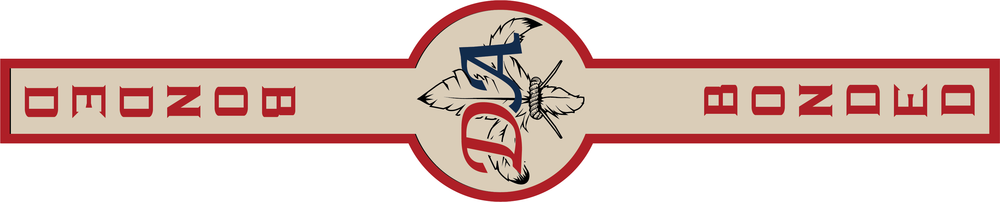

# TTB COLA Label Images - TTBID 26033001000562

**Brand Name:** DISTILLERIE ACADIAN

**Fanciful Name:** CAJUN'S CUT

**Issue Date:** 02/06/2026

**Origin Code:** 23

**Product Class/Type:** 119

**Source:** [TTB Public COLA Registry](https://ttbonline.gov/colasonline/viewColaDetails.do?action=publicFormDisplay&ttbid=26033001000562)

## Label Images

### Back Label

### Front Label

### Label 2

## Extracted Label Text

*Text extracted via OCR - may contain errors*

### Back Label

LOUISIANA'’S FIRST BOURBON MADE FROM A

FOUR-GRAIN MASH OF CORN, RYE, WHEAT, AND

BARLEY. THIS NON-CHILL FILTERED WHISKEY

OFFERES A PERFECT BALANCE OF SPICE AND

MELLOWNESS WITH UNAPOLOGETICALLY BOLD

FLAVORS AND A NEVER ENDING FINISH.

IMLASHBILL:

69% CORN, 12% RYE, 6% WHEAT, 13% MALTED BARLEY

DISTILLED, AGED, AND BOTTLED BY:

DISTILLERIE ACADIAN

DSP-LA-20012

NEW IBERIA, LA

£50 ML

GOVERNMENT WARNING: (1) ACCORDING TO THE

SURGEON GENERAL, WOMEN SHOULD NOT DRINK

ALCOHOLIC BEVERAGES DURING PREGNANCY

BECAUSE OF RISK OF BIRTH DEFECTS.

(2)

CONSUMPTION OF ALCOHOLIC BEVERAGES

OPERATE MACHINERY, AND MAY CAUSE HEALTH

IMPAIRS YOUR ABILITY TO DRIVE A CAR O

PROBLEMS.

wh

### Front Label

Sasuns Gor

LOUIS

ANA STRAIGHT BOURBON WHISKEY

— BOTTLED-IN-BOND —

### Label 2

OoOMoZzom

=)

POZO Wo
