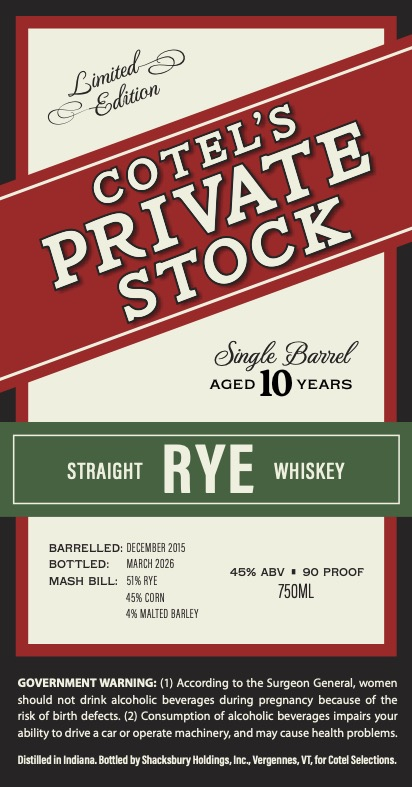

# TTB COLA Label Images - TTBID 26033001000591

**Brand Name:** COTEL'S PRIVATE STOCK

**Issue Date:** 03/18/2026

**Origin Code:** 46

**Product Class/Type:** 102

**Source:** [TTB Public COLA Registry](https://ttbonline.gov/colasonline/viewColaDetails.do?action=publicFormDisplay&ttbid=26033001000591)

## Label Images

### Label 1

## Extracted Label Text

*Text extracted via OCR - may contain errors*

**Detected Proof:** 90
**Detected Age:** 10 Years

### Label 1

Bajnel
AGED
10
YEARS
STRAIGHT
RYE
WHISKEY
BARRELLED: DECEMBER 2015
BOTTLED:
WARCH 2026
45% ABV
90 PROOF
MASH BILL:
5158 FYE
455 CoaM
750ML
MALTED baalEY
GOVERNMENT WARNING: (1) According
the Surgeon General, women
should not drink alcoholic beverages during pregnancy because of the
risk of birth defects. (2) Consumption of alcoholic beverages impairs your
ability
drive
cai Oi
operate machinery; and may cause health problems
Distilled in Indiana.Bottled by Shacksbury Holdings; Inc , Vergennes, VT; for Cotel Selections
Bimited
Sdition
COTELS
PRIVATE
STOCK
eSingle
