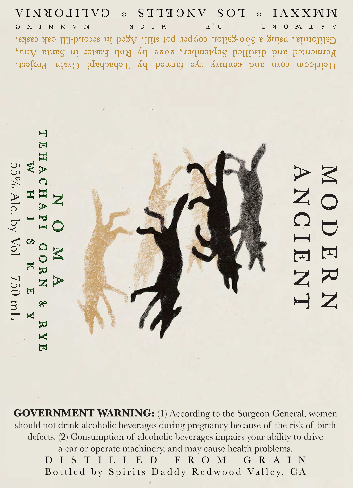
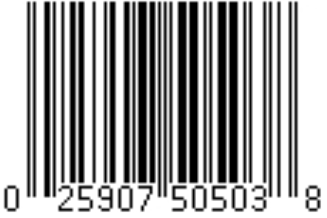

# TTB COLA Label Images - TTBID 26033001000682

**Brand Name:** MODERN ANCIENT

**Fanciful Name:** NOMA

**Issue Date:** 02/05/2026

**Origin Code:** 01

**Product Class/Type:** 140

**Source:** [TTB Public COLA Registry](https://ttbonline.gov/colasonline/viewColaDetails.do?action=publicFormDisplay&ttbid=26033001000682)

## Label Images

### Label 1

### Label 2

## Extracted Label Text

*Text extracted via OCR - may contain errors*

### Label 1

VINYOATIVO

ok

SHTHUNV SO'l

os

ITAXXWW

Oo N I N N V W

YM oOo |. W

K 6

4 Yu on L ad V

‘syseo Yeo [[y-puosas ut pasy *[[ys yod 1addoo uojjes-oog e Sutsn ‘etusosTeN

"euy eyUeg UT Jaysey qoy Aq 3506 ‘raquiajdag paj[ystp pue pazyuUswisay

‘paforg uterg Ideyoeyay, Aq powurey adr AInjuad> pue uO. WOOTITOP]

=>

a=

oo

be

AZO

py PS

HO

wie

Og

ah tg

pry (71

A

is

He

ZP

ns ine tik

Ze

wre “t

HZ

[7

GOVERNMENT WARNING: (1) According to the Surgeon General, women

should not drink alcoholic beverages during pregnancy because of the risk of birth

defects. (2) Consumption of alcoholic beverages impairs your ability to drive

a car or operate machinery, and may cause health problems.

DIS TILL E D

FROM

G RAIN

Bottled by Spirits Daddy Redwood Valley, GCA

### Label 2

wH

25907"S0503
