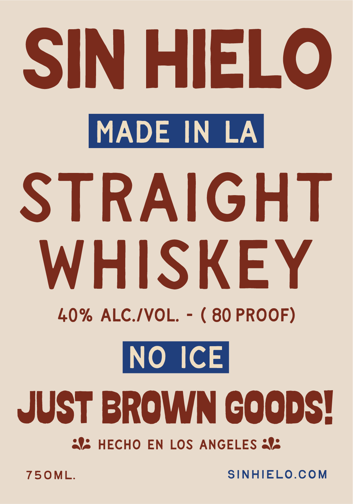
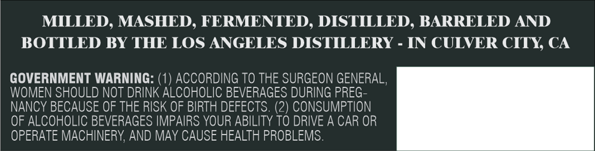

# TTB COLA Label Images - TTBID 26033001000709

**Brand Name:** SIN HIELO

**Issue Date:** 02/06/2026

**Origin Code:** 01

**Product Class/Type:** 109

**Source:** [TTB Public COLA Registry](https://ttbonline.gov/colasonline/viewColaDetails.do?action=publicFormDisplay&ttbid=26033001000709)

## Label Images

### Label 1

### Label 2

## Extracted Label Text

*Text extracted via OCR - may contain errors*

### Label 1

SIN HIELO

STRAIGHT

WHISKEY

40% ALC./VOL. - ( 80 PROOF)

NO ICE

JUST BROWN Coops!

### Label 2

MILLED, MASHED, FERMENTED, DISTILLED, BARRELED AND

BOTTLED BY THE LOS ANGELES DISTILLERY - IN CULVER CITY, CA

GOVERNMENT WARNING: (1) ACCORDING TO THE SURGEON GENERAL,

WOMEN SHOULD NOT DRINK ALCOHOLIC BEVERAGES DURING PREG-

NANCY BECAUSE OF THE RISK OF BIRTH DEFECTS. (2) CONSUMPTION

OF ALCOHOLIC BEVERAGES IMPAIRS YOUR ABILITY TO DRIVE A CAR OR

OPERATE MACHINERY, AND MAY CAUSE HEALTH PROBLEMS
