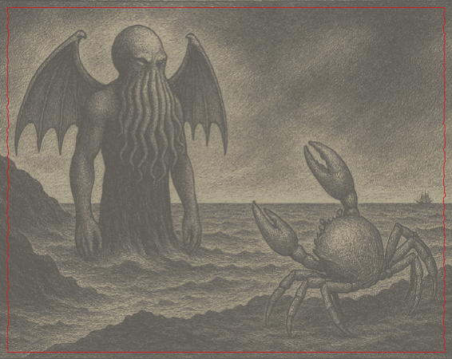
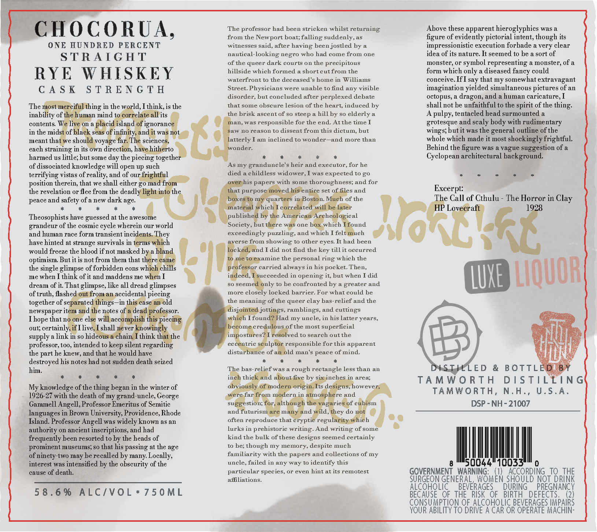

# TTB COLA Label Images - TTBID 26034001000125

**Brand Name:** CHOCORUA

**Issue Date:** 02/13/2026

**Origin Code:** 33

**Product Class/Type:** 102

**Source:** [TTB Public COLA Registry](https://ttbonline.gov/colasonline/viewColaDetails.do?action=publicFormDisplay&ttbid=26034001000125)

## Label Images

### Back Label

### Front Label

### Label 3

## Extracted Label Text

*Text extracted via OCR - may contain errors*

*1 image(s) excluded: text did not meet readability threshold*

### Front Label

hs

The professor had been stricken whilst returning:

Above these apparent hieroglyphics was a

CHOCORUA,

from the Newport boat; falling suddenly, as

figure of evidently pictorial intent, though its

ONE HUNDRED PERCENT

witnesses said, after having been jostled by a

impressionistic execution forbade a very clear

idea of its nature. It seemed to be a sort of

STRAIGHT

nautieal-looking negro who had come from one

of the queer dark courts on the precipitous

monster, or symbol representing a monster, of a

hillside which formed a short eut from the

RYE WHISKEY

form which only a diseased fancy could

waterfront to the deceased's home in Williams

conceive. If] say that my somewhat extravagant

Street. Physicians were unable to find any visible

imagination yielded simultaneous pictures of an

CASK STRENGTH

disorder, but concluded after perplexed debate

octopus, a dragon, and a human caricature, I

The

that some obseure lesion of the heart, induced by

shall not be unfaithful to the spirit of the thing.

ing in the world, Think, is the

inability of

mind

its

the brisk ascent of so steep a hill by so elderly a

A pulpy, tentacled head surmounted a

contents,

mn a

¢

an, Was responsible for the end. Atthe time I

grotesque and scaly hody with rudimentary

ignoran:

a

in the mid

(Ww no reason to dissent from this dictum, but

wings; but it was the general outline of the

meant tha

e shor

voyi

scienc

{.

latterly Iam inelined to wonder—and more than

whole which made it most shockingly frightful.

onder.

each straining in its

direc:

hi

Behind the figure was a vague suggestion of a

harmed us little; but some day the piecing togeth

>»

‘

*

+

*

*

*

Cyclopean architectural background.

As my grandunele's heir and executor, for he

of dissociated knowledge will open up such

terrifying vistas of reality, and of ow

a

died a childless widower, I was expected to go

.

oy

*

.

gonad

is papers with some thoroughness; and for

position therein, that we shall either go

the revelation or flee from the deadh

1 purpos:

sand

Excerpt:

ua)

of the

e Call of Cthulu - The Horror in Clay

peace and safety of a new dark age.

"

[.

ie!

*

.

*

*

.

ma

4

ublish

‘ical

Theosophists have guessed at the awes

ut

one

which

und

grandeur of the cosmic cycle wherein our world

Society,

and human race form transient inci

oy

exeeedingly puzzling, and whieh I fel

eh

‘No

have hinted at strange survivals in

erse from showing: to other eyes. It had been

would freeze the blood if not masked b:

id I did not find the key till it occurred

\L RE

amine the personal ring which the

optimism, But it is not from them that

the single glimpse of forbidden eons w1

carried always in his pocket. Then,

me when I think of it and maddens me

RAS

succeeded in opening: it, but when I did

tN

so seem

nly to be confronted by a greater and

of truth, flashe;

dream of it. That glimpse, like all dread glimpses

more closely loeked barrier. For what could be

=

yg 11008

ccidental piecing

together of s

gs—in

ld

the meaning of the queer clay bas-relief and the

newspaper its

tes

Sor,

is,

jor

s, ramblings, and euttings

Tfoun

Thope thatn

else wi

iad my uncle, in his latter years,

out; certainh

Tliv

shall

ver

<

ere

us of the most superficial

as

es

ed to search out the

supply a link in so hid

ait

think

professor, 100, intended to keep silent regardi:

ec.

trie

Ip

responsible for this apparent

distui

e of

x

1d man's peace of mind.

the part he knew, and that he would have

destroyed his notes had not sudden death seized

+

*

*

him.

The bas-rel

D

ED & BOTTLE

*

*

*

*

.

in

thi

id

flwas a rough rectangle less than an

b:

meh

area:

TAMWORTH DISTILEING

01

, howeve:

My knowledge of the thing began in the winter of

:

re and.

TAMWORTH, N.H., U.S.A.

1926-27 with the death of my grand-uncle, George

Gammell Angell, Professor Emeritus of Semitic

su

Stik

of 1

DSP - NH - 21007

an

tari!

A

=

mi

languages in Brown University, Providence, Rhode

ey do

Island. Professor Angell was widely known as an

often reproduce that

ptie regu

y

eh

ee

lurks in prehistorie writing. And writing of some

authority on ancient inscriptions, and had

frequently been resorted to by the heads of

kind the bulk of these designs seemed certainly

to be; though my memory, despite much

prominent museums; so that his passing at the age

of ninety-two may be recalled by many. Locally,

familiarity with the papers and collections of my

uncle, failed in any way to identify this

8 I

i

interest was intensified by the obscurity of the

cause of death.

particular species, or even hint at its remotest

GOVERNMENT WARNING: (1) ACCORDING TO THE

affiliations.

SURGEON GENERA

0

E

SHO

D NOT DRINK

ALCOHOLIC BEVERAGES

URING PREGNANCY

58.6% ALC/VOL*750ML

BECAUSE OF THE

ISK OF BIRTH

EFECTS.

2}

CONSUMPTION OF ALCOHOLIC BEVERAGES IMPAIRS

YOUR ABILITY TO DRIVE A CAR OR OPERATE MACHIN-

### Label 3

CASK STRENGTH
AGED 8 YEARS
CRAFTED BY HAND IN THE
GRANITE STATE
GED AGED TO PERFECTION Goes
