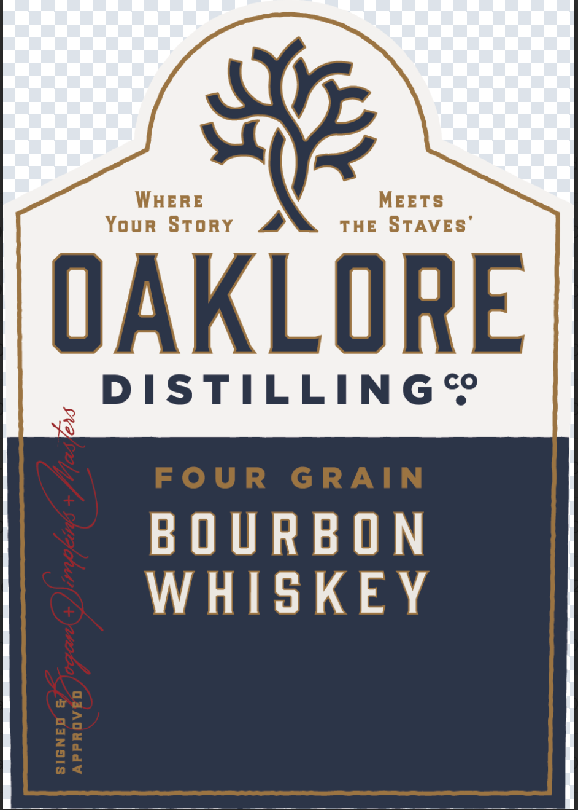
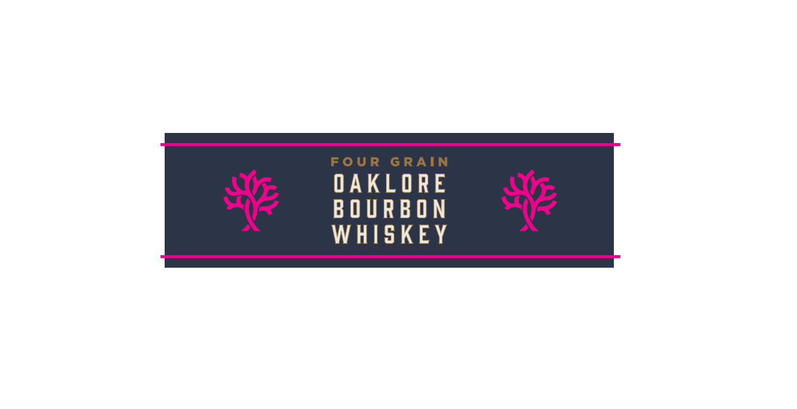
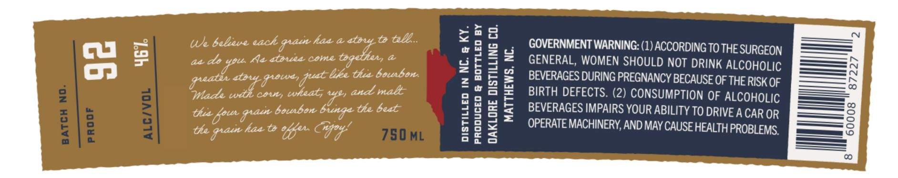

# TTB COLA Label Images - TTBID 26034001000252

**Brand Name:** OAKLORE DISTILLING CO.

**Fanciful Name:** FOUR GRAIN BOURBON WHISKEY

**Issue Date:** 02/10/2026

**Origin Code:** 35

**Product Class/Type:** 141

**Source:** [TTB Public COLA Registry](https://ttbonline.gov/colasonline/viewColaDetails.do?action=publicFormDisplay&ttbid=26034001000252)

## Label Images

### Label 1

### Label 2

### Label 3

