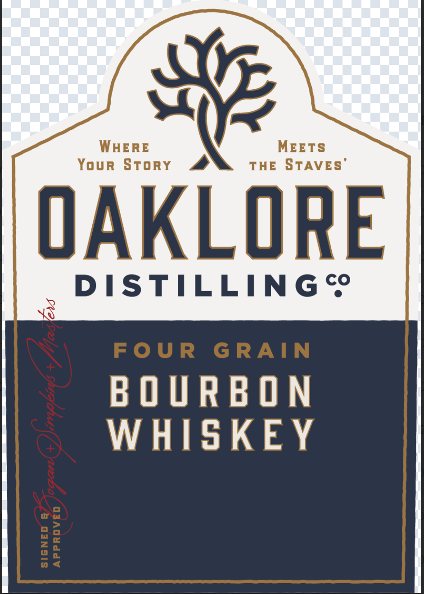
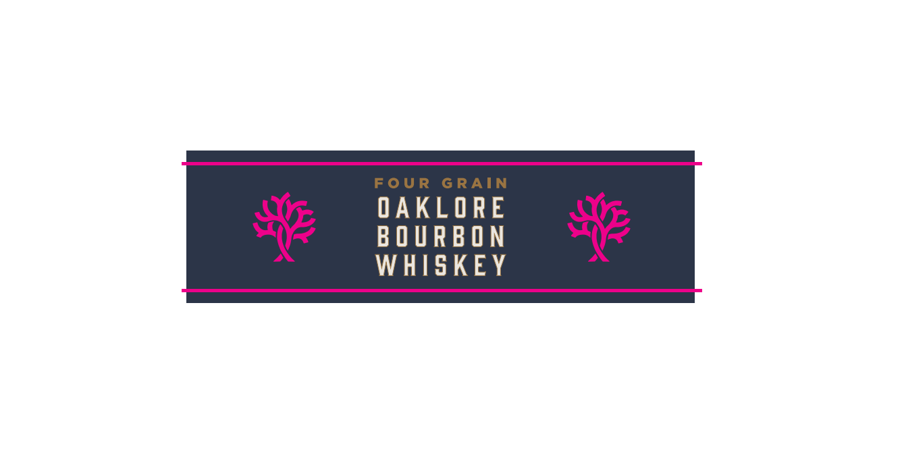
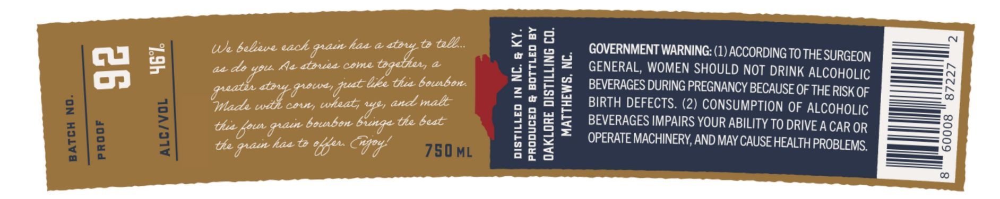

# TTB COLA Label Images - TTBID 26034001000252

**Brand Name:** OAKLORE DISTILLING CO.

**Fanciful Name:** FOUR GRAIN BOURBON WHISKEY

**Issue Date:** 02/10/2026

**Origin Code:** 35

**Product Class/Type:** 141

**Source:** [TTB Public COLA Registry](https://ttbonline.gov/colasonline/viewColaDetails.do?action=publicFormDisplay&ttbid=26034001000252)

## Label Images

### Label 1

### Label 2

### Label 3

## Extracted Label Text

*Text extracted via OCR - may contain errors*

*2 image(s) excluded: text did not meet readability threshold*

### Label 3

GOVERNMENT WARNING: (1) ACCORDING T0 THE SURGEON

GENERAL, WOMEN SHOULD NOT DRINK ALCOHOLIC

= |

—————

—~

BEVERAGES DURING PREGNANCY BECAUSE OF THE RISK OF

———

BIRTH DEFECTS. (2) CONSUMPTION OF ALCOHOLIC

aft

EI

BEVERAGES IMPAIRS YOUR ABILITY TO DRIVE A CAR OR

[a

SS ao

eo

—o

750 ML

no

Sie

OPERATE MACHINERY, AND MAY CAUSE HEALTH PROBLEMS.

Sn
