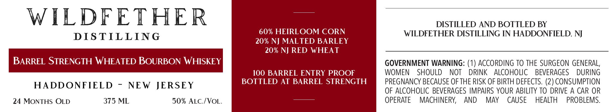

# TTB COLA Label Images - TTBID 26034001000254

**Brand Name:** WILDFETHER DISTILLING

**Issue Date:** 02/12/2026

**Origin Code:** 03

**Product Class/Type:** 141

**Source:** [TTB Public COLA Registry](https://ttbonline.gov/colasonline/viewColaDetails.do?action=publicFormDisplay&ttbid=26034001000254)

## Label Images

### Label 1

## Extracted Label Text

*Text extracted via OCR - may contain errors*

### Label 1

WILDFETHER

DISTILLED AND BOTTLED BY

60% HEIRLOOM CORN WILDFETHER DISTILLING IN HADDONFIELD, NJ
DISTILLING 20% NJ MALTED BARLEY

20% NJ RED WHEAT

BARREL STRENGTH WHEATED BOURBON WHISKEY

GOVERNMENT WARNING: (1) ACCORDING TO THE SURGEON GENERAL,
100 BARREL ENTRY PROOF WOMEN SHOULD NOT DRINK ALCOHOLIC BEVERAGES DURING

= BOTTLED AT BARREL STRENGTH PREGNANCY BECAUSE OF THE RISK OF BIRTH DEFECTS. (2) CONSUMPTION

aceeeeemeeiaeriiaame hdl manele OF ALCOHOLIC BEVERAGES IMPAIRS YOUR ABILITY TO DRIVE A CAR OR

24 MONTHS OLD 375 ML 50% ALC./VOL. OPERATE MACHINERY, AND MAY CAUSE HEALTH PROBLEMS.
