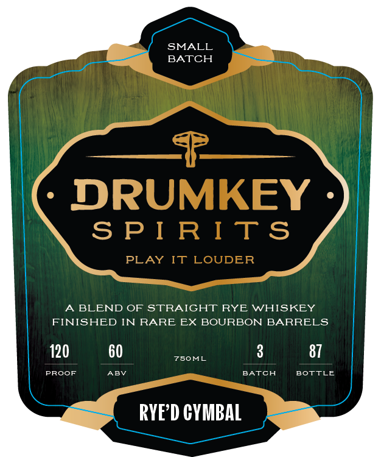
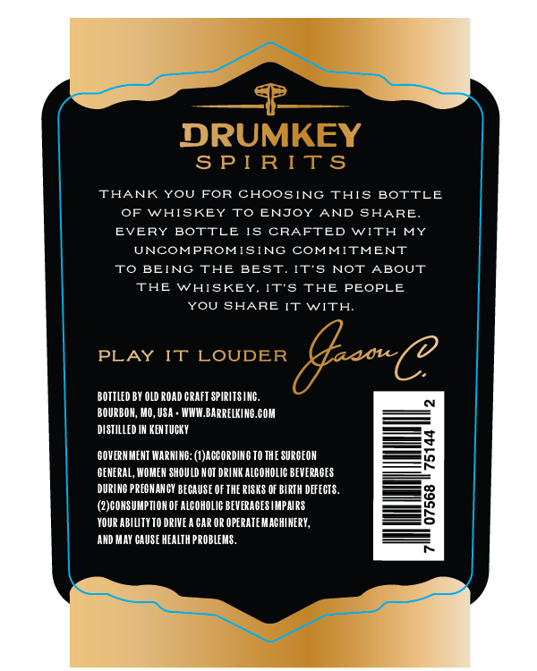

# TTB COLA Label Images - TTBID 26034001000262

**Brand Name:** DRUMKEY SPIRITS

**Fanciful Name:** RYE'D CYMBAL

**Issue Date:** 02/09/2026

**Origin Code:** 29

**Product Class/Type:** 122

**Source:** [TTB Public COLA Registry](https://ttbonline.gov/colasonline/viewColaDetails.do?action=publicFormDisplay&ttbid=26034001000262)

## Label Images

### Label 1

### Label 2

## Extracted Label Text

*Text extracted via OCR - may contain errors*

### Label 1

SMALL

BATCH

A BLEND OF STRAIGHT RYE WHISKEY

FINISHED IN RARE EX BOURBON BARRELS

120

60

750ML.

3

87

PROOF

ABV

BATCH

BOTTLE

RYE’D CYMBAL

### Label 2

THANK YOU FOR CHOOSING THIS BOTTLE

OF WHISKEY TO ENJOY AND SHARE

EVERY BOTTLE IS CRAFTED WITH MY

UNCOMPROMISING COMMITMENT

TO BEING THE BEST. IT’S NOT ABOUT

THE WHISKEY, IT’S THE PEOPLE

YOU SHARE IT WITH

BOTTLED BY OLD ROAD GRAFT SPIRITSINC.

BOURBON, MO, USA. WHW.BARRELKING.COM

DISTILLED IN KENTUCKY

—F

-—*4

‘GOVERNMENT WARNING: (I)AGEORDING TO THE SURGEON

9

-—4

‘GENERAL, WOMEN SHOULD NOT DRINK ALCOHOLIG BEVERAGES

DURING PREGNANCY BECAUSE OF THE RISKS OF BIRTH DEFECTS.

7

}—F

(2)CONSUMPTION OF ALCOHOLIC BEVERAGES IMPAIRS

_—s

YOUR ABILITYTO DRIVEA GAR OR OPERATEMAGHINERY,

‘AND MAY CAUSE HEALTH PROBLEMS.
