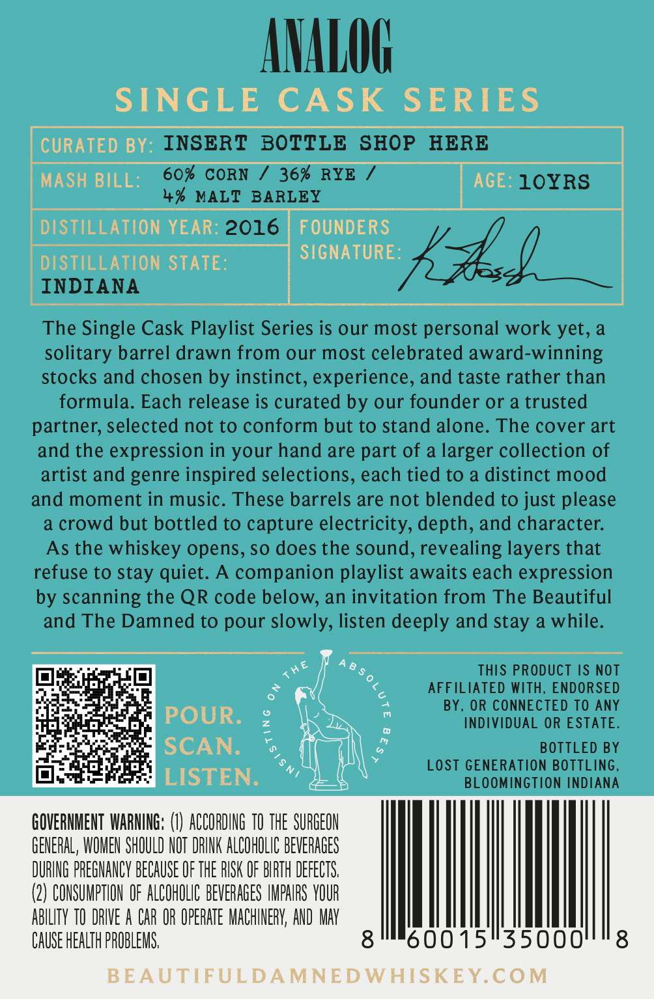
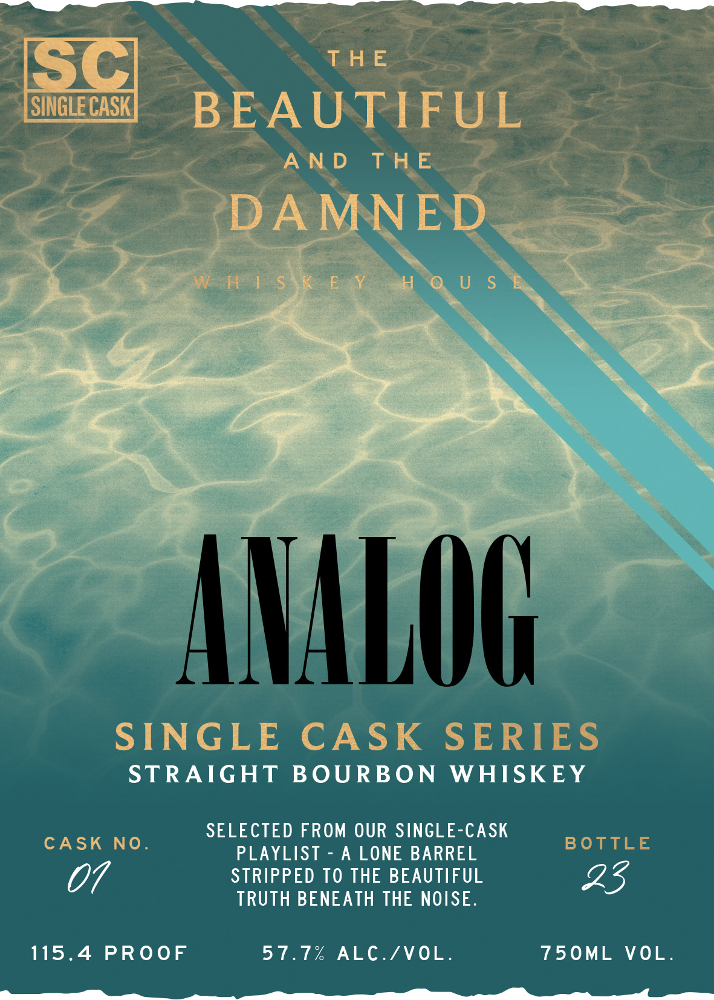

# TTB COLA Label Images - TTBID 26034001000296

**Brand Name:** ANALOG

**Issue Date:** 02/20/2026

**Origin Code:** 19

**Product Class/Type:** 101

**Source:** [TTB Public COLA Registry](https://ttbonline.gov/colasonline/viewColaDetails.do?action=publicFormDisplay&ttbid=26034001000296)

## Label Images

### Back Label

### Front Label

## Extracted Label Text

*Text extracted via OCR - may contain errors*

### Back Label

SINGLE CASK SERIES
INSERT BOTTLE SHOP HERE
60% CORN / 36% RYE / --10YRS

4% MALT BARLEY
DISTILLATION YEAR: 2c: | FOUNDERS
DISTILLATION STATE: SEL UU Lf
INDIANA
The Single Cask Playlist Series is our most personal work yet, a
solitary barrel drawn from our most celebrated award-winning
stocks and chosen by instinct, experience, and taste rather than
formula. Each release is curated by our founder or a trusted
partner, selected not to conform but to stand alone. The cover art
and the expression in your hand are part of a larger collection of
artist and genre inspired selections, each tied to a distinct mood
and moment in music. These barrels are not blended to just please
a crowd but bottled to capture electricity, depth, and character.
As the whiskey opens, so does the sound, revealing layers that
refuse to stay quiet. A companion playlist awaits each expression
by scanning the QR code below, an invitation from The Beautiful
and The Damned to pour slowly, listen deeply and stay a while.
7" ; ae |) (8s THIS PRODUCT IS NOT
aos & % AFFILIATED WITH, ENDORSED
Pei cHites ta Fp : a BY, OR CONNECTED TO ANY
a a POUR. Zz - INDIVIDUAL OR ESTATE.
ped SOCAN a o. BOTTLED BY
Chody-og s ® LOST GENERATION BOTTLING,
a: e LISTEN. ” BLOOMINGTION INDIANA
HOVERNMENT WARNING: (1) ACCORDING 10 THE SURGEON
GENERAL WOMEN SHOULD NOT DRINK ALCOHOLIC BEVERAGES
DURING PREGNANCY BECAUSE OF THE RISK OF BIRTH DEFECTS.
(2) CONSUMPTION OF ALCOHOLIC BEVERAGES IMPAIRS YOUR
BILITY 10 DRIVE A CAR OR OPERATE MACHINERY, AND MA
SE HEALTH PROBLEMS. 0015"35000

### Front Label

a Fs]

THE

{Oo

Ci

BEA UT

|

I

Blow

AND THE

/

)

f

IV

J

dil

|

i

POE

CA

<

V4

SING

Y je)

nN

i»)

en BOURBON WHISKEY

CASK NO

SELECTED FROM OUR SINGLE-CASK

BO

PLAYLIST - A LONE BARREL

STRIPPED TO THE BEAUTIFUL

07

TRUTH BENEATH THE NOISE

25

115.4 PROOF

57.7% ALC./VOL

750ML VOL

Se SS OSS a
