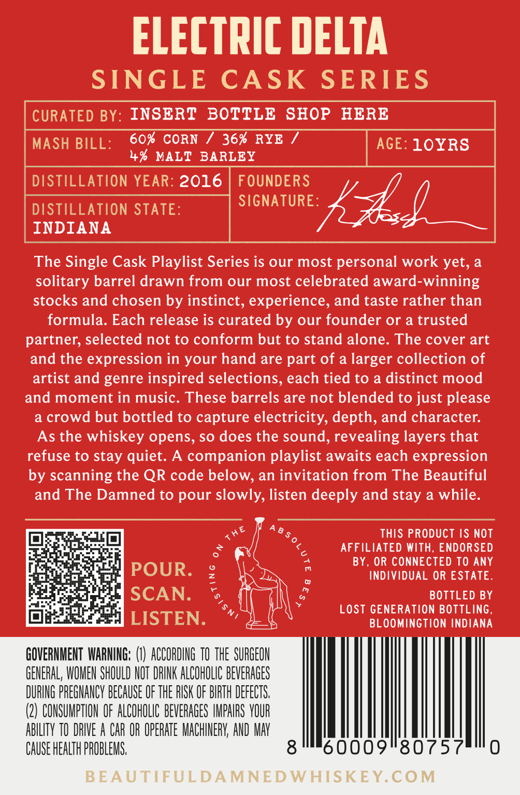

# TTB COLA Label Images - TTBID 26034001000300

**Brand Name:** ELECTRIC DELTA

**Issue Date:** 02/20/2026

**Origin Code:** 19

**Product Class/Type:** 101

**Source:** [TTB Public COLA Registry](https://ttbonline.gov/colasonline/viewColaDetails.do?action=publicFormDisplay&ttbid=26034001000300)

## Label Images

### Back Label

### Front Label

## Extracted Label Text

*Text extracted via OCR - may contain errors*

### Back Label

eal [a]

io

Satis

Bea

Ld

out

oO

aa

ae

crt

GOVERNMENT WARNING: (I) ACCORDING 70 THE SURGEON

GENERAL, WOMEN SHOULD NOT DRINK ALCOHOLIC BEVERAGES

DURING PREGNANCY BECAUSE OF THE RISK OF BIRTH DEFECTS.

(2) CONSUMPTION OF ALCOHOLIC BEVERAGES IMPAIRS YOUR

ABILITY TO DRIVE A CAR OR OPERATE MACHINERY, AND MAY

|

CAUSE HEALTH PROBLEMS.

L

0009"80757

}

### Front Label

Fig il=

SINGLE CASK

BEAUTIFUL

AND THE

at

DAMN

WiH IS &

o“e 4

a

‘vel a2.

9

®

%.

VA

ie

CD

LTA

i

PLE CASK.SERTES

¥

STRAIGHT BOURBON mS AY

&

FROM OUR SINGLE

K-

PLAYLIST - WHAT BI

BOTTLE

ACOUSTIC ENDS ELE

Ic.

an

#5

F}

4 PROOF

57.7% ALC./VOL

750ML VOL
