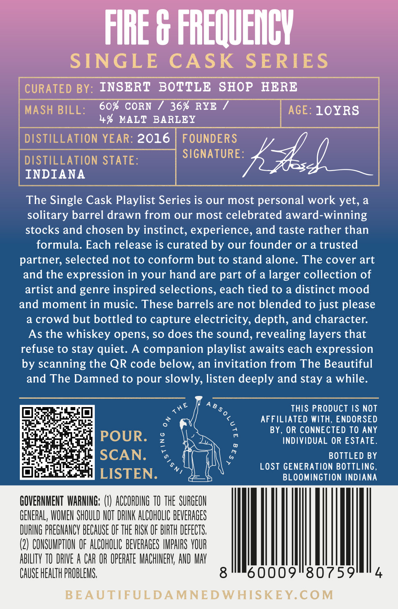
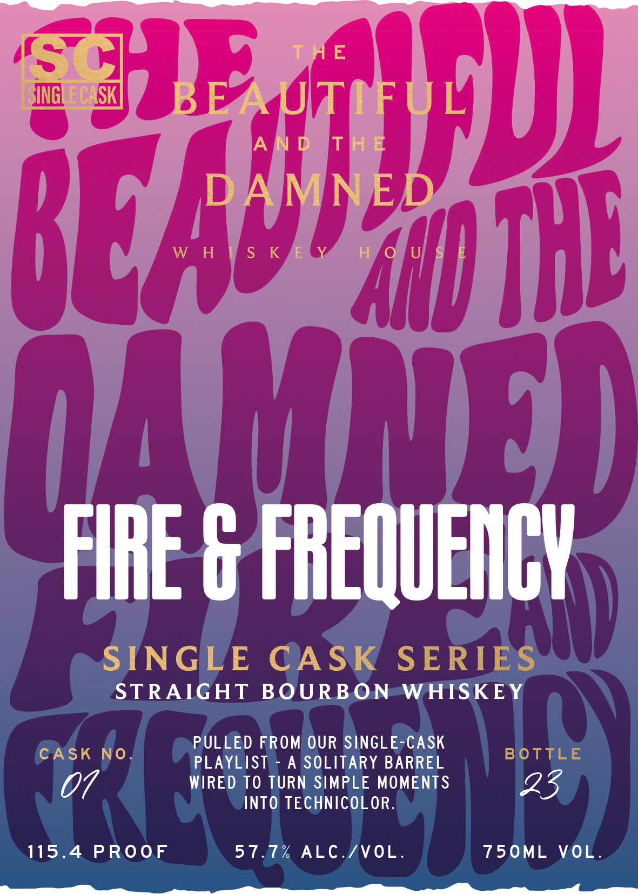

# TTB COLA Label Images - TTBID 26034001000305

**Brand Name:** FIRE & FREQUENCY

**Issue Date:** 02/20/2026

**Origin Code:** 19

**Product Class/Type:** 101

**Source:** [TTB Public COLA Registry](https://ttbonline.gov/colasonline/viewColaDetails.do?action=publicFormDisplay&ttbid=26034001000305)

## Label Images

### Back Label

### Front Label

## Extracted Label Text

*Text extracted via OCR - may contain errors*

### Back Label

sreegrerarco

3y: INSERT BOTTLE SHOP HERE
60% CORN / 36% RYE / aE.
4% MALT BARLEY GE’ LORS

TION Y else LP J
INDIANA , |

The Single Cask Playlist Series is our most personal work yet, a
solitary barrel drawn from our most celebrated award-winning
stocks and chosen by instinct, experience, and taste rather than
formula. Each release is curated by our founder or a trusted
partner, selected not to conform but to stand alone. The cover art
and the expression in your hand are part of a larger collection of
artist and genre inspired selections, each tied to a distinct mood
and moment in music. These barrels are not blended to just please
a crowd but bottled to capture electricity, depth, and character.
As the whiskey opens, so does the sound, revealing layers that
refuse to stay quiet. A companion playlist awaits each expression
by scanning the QR code below, an invitation from The Beautiful
and The Damned to pour slowly, listen deeply and stay a while.

Ses THIS PRODUCT IS NOT
<, AFFILIATED WITH, ENDORSED

4 BY, OR CONNECTED TO ANY

a INDIVIDUAL OR ESTATE.

es BOTTLED BY

LOST GENERATION BOTTLING,
BLOOMINGTION INDIANA

0009"80759

GENERAL, WOMEN SHOULD NOT DRINK ALCOHOLIC BEVERAGES
DURING PREGNANCY BECAUSE OF THE RISK OF BIRTH DEFECTS,
(2) CONSUMPTION OF ALCOHOLIC BEVERAGES IMPAIRS YOUR

ABILITY TO DRIVE A CAR OR OPERATE MACHINERY, AND MAY
CAUSE HEALTH PROBLEMS.

BEAUTIFULDAMNEDWHISKEY.COM

GOVERNMENT WARNING: () ACCORDNG TO THE SURGEON
3 lg

### Front Label

STRAIGHT BOURBON=W

PULLED FROM OUR SINGLE-CA‘

PLAYLIST - A SOLITARY BARREL

WIRED TO TURN SIMPLE MOMENTS
INTO TECHNICOLOR.

115.4 PROOF 57.7% ALC./VOL. 750ML VOL.

Ne OS
