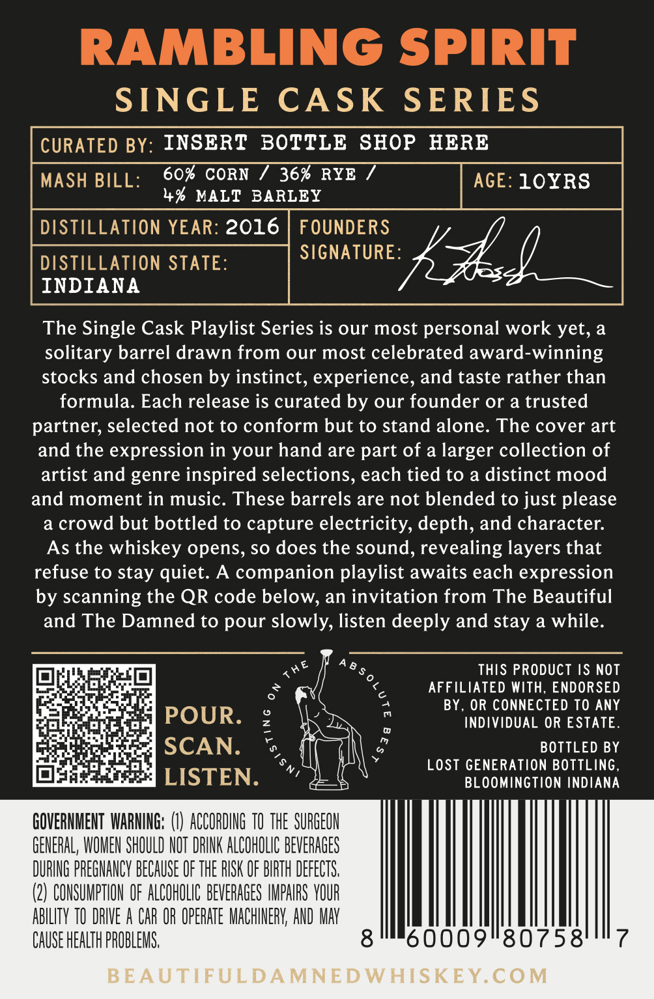
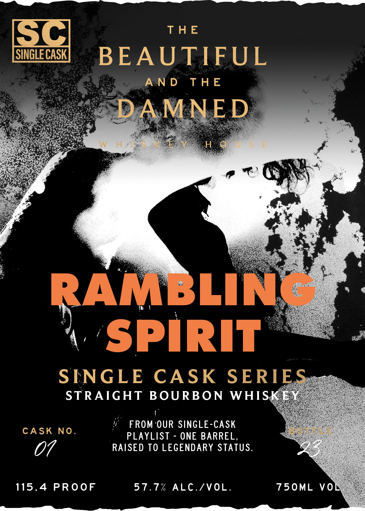

# TTB COLA Label Images - TTBID 26034001000308

**Brand Name:** RAMBLING SPIRIT

**Issue Date:** 02/20/2026

**Origin Code:** 19

**Product Class/Type:** 101

**Source:** [TTB Public COLA Registry](https://ttbonline.gov/colasonline/viewColaDetails.do?action=publicFormDisplay&ttbid=26034001000308)

## Label Images

### Back Label

### Front Label

## Extracted Label Text

*Text extracted via OCR - may contain errors*

### Back Label

SINGLE CASK SERIES

CURATED BY: INSERT BOTTLE SHOP HERE

MASH BILL:

60% CORN / 36% RYE /

4% MALT BARLEY

SIGNATURE

DISTILLATION STATE:

INDIANA

fod

The Single Cask Playlist Series is our most personal work yet, a

solitary barrel drawn from our most celebrated award-winning

stocks and chosen by instinct, experience, and taste rather than

formula. Each release is curated by our founder or a trusted

partner, selected not to conform but to stand alone. The cover art

and the expression in your hand are part of a larger collection of

artist and genre inspired selections, each tied to a distinct mood

and moment in music. These barrels are not blended to just please

a crowd but bottled to capture electricity, depth, and character.

As the whiskey opens, so does the sound, revealing layers that

refuse to stay quiet. A companion playlist awaits each expression

by scanning the QR code below, an invitation from The Beautiful

and The Damned to pour slowly, listen deeply and stay a while.

Ze

Ae

THIS PRODUCT IS NOT

2) eof ct a]

AFFILIATED WITH, ENDORSED

BY, OR CONNECTED TO ANY

POUR

INDIVIDUAL OR ESTATE.

Tey

Heal

Pat

BOTTLED BY

aa x

Br?

SCAN.

LOST GENERATION BOTTLING,

OF

ray

LISTEN.

4,

BLOOMINGTION INDIANA

GOVERNMENT WARNING: (I) ACCORDING 10 THE SURGEON

GENERAL, WOMEN SHOULD NOT DRINK ALCOHOLIC BEVERAGES

DURING PREGNANCY BECAUSE OF THE RISK OF BIRTH DEFECTS.

(2) CONSUMPTION OF ALCOHOLIC BEVERAGES IMPAIRS YOUR

ABILITY TO DRIVE A CAR OR OPERATE MACHINERY, AND MAY

CAUSE HEALTH PROBLEMS,

8im60009"80758'"7

### Front Label

THE

BEAUTIFUL

AND THE

PaaS ae

aoe

et

‘est

at

‘-

a «

Ye

x!

4’

\

SINGLE CASK SERI

STRAIGHT BOCRE ON WHI

if FROM-OUR SINGLE-CASK

CASK NO.

PLAYLIST - ONE BARREL,

RAISED TO LEGENDARY STATUS

07

115.4 PROOF

57.7% ALC./VOL.

750ML VO
