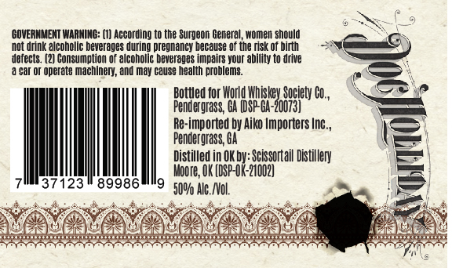
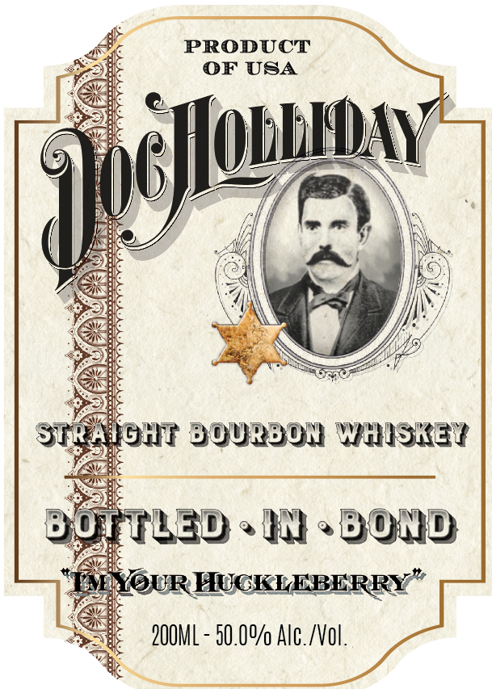

# TTB COLA Label Images - TTBID 26034001000317

**Brand Name:** DOC HOLLIDAY

**Issue Date:** 02/06/2026

**Origin Code:** 37

**Product Class/Type:** 101

**Source:** [TTB Public COLA Registry](https://ttbonline.gov/colasonline/viewColaDetails.do?action=publicFormDisplay&ttbid=26034001000317)

## Label Images

### Back Label

### Front Label

## Extracted Label Text

*Text extracted via OCR - may contain errors*

*1 image(s) excluded: text did not meet readability threshold*

### Back Label

GOVERNMENT WARNING: (1) According to the Surgeon General, women should

‘hot drink alcoholic beverages during pregnancy because of the risk of birth

defects. (2) Consumption of alconolic beverages impairs your ability to drive

‘car oF operate machinery, and may cause health problems.

sie

Bottled for World Whis

Penderarass, GA (DSP-GA:

rh

eet ,

Re-imported by Aiko Importers Inc.,

—

Pendergrass, GA

Distilled in OK:

=

7

37123" 89986

|

Woore,

iene Distillery

50%.

ee,

ree:

Be docks

wu

Oe

Ws

o)

ul

es

pa

ie

See

oteasss

meine

Phish
