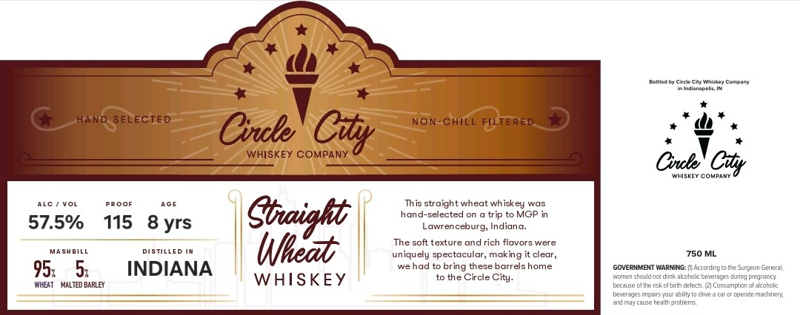

# TTB COLA Label Images - TTBID 26034001000366

**Brand Name:** CIRCLE CITY WHISKEY COMPANY

**Issue Date:** 02/06/2026

**Origin Code:** 19

**Product Class/Type:** 140

**Source:** [TTB Public COLA Registry](https://ttbonline.gov/colasonline/viewColaDetails.do?action=publicFormDisplay&ttbid=26034001000366)

## Label Images

### Label 1

## Extracted Label Text

*Text extracted via OCR - may contain errors*

### Label 1

*h

a

ext Cxes ny way Comoany

—

inane

oe)

AA

dh.

aay

ISKEY COMPANY ©

Out! Cay

ate / vow

PRoor

ace

This straight wheat whiskey was

hand-selected on a trip to MGP in

57.5%

Lawrenceburg, Indiana.

115 8yrs

Cboaight

masweiLe

DisTILLeD IN

}

The soft texture and rich flavors were

hee

uniquely spectacular, making it clear,

750 ML

95:

5:

INDIANA

we had to bring these barrels home

GOVERNMENT WARNING: cxsng oe Suyeon Gera

WHEAT MALTED BARLEY

WHISKEY

to the Circle City.

\wanen shuld kako beverages sng regrancy

Because ofthe ko rh eles (2 Corsungtnfacoole

“i

=

beverages impasour ably ta ve a car sperte mache

fay eau heath role
