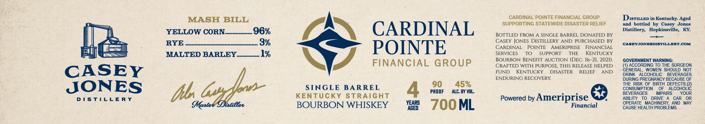

# TTB COLA Label Images - TTBID 26034001000387

**Brand Name:** CARDINAL POINTE FINANCIAL GROUP

**Issue Date:** 02/06/2026

**Origin Code:** 22

**Product Class/Type:** 101

**Source:** [TTB Public COLA Registry](https://ttbonline.gov/colasonline/viewColaDetails.do?action=publicFormDisplay&ttbid=26034001000387)

## Label Images

### Label 1

### Label 2

## Extracted Label Text

*Text extracted via OCR - may contain errors*

### Label 1

MASH BILL

CARDINAL POINTE FINANCIAL GROUP.

Disruiep in Kentucky. Aged

SUPPORTING STATEWIDE DISASTER RELIEF

and bottled by Casey Jones

=p

A

Distillery, Hopkinsville, KY.

tl

YELLOW CORN nem 96%

CARDINAL

BOTTLED FROM A SINGLE BARREL DONATED BY

—

CASEY JONES DISTILLERY AND PURCHASED BY

|

RYE 2h

(CASEYJONESDISTILLERY.COM

| sre

CARDINAL POINTE AMERIPRISE FINANCIAL

ill

1 MTT

MALTED BARLEV........... 1%

POINTE

SERVICES

To

SUPPORT THE

KENTUCKY

BOURBON BENEFIT AUCTION (DEC. 16-21, 2021)

GOVERNMENT WARNING:

FINANCIAL GROUP

CRAFTED WITH PURPOSE, THIS RELEASE HELPED

(1) ACCORDING TO THE SURGEON

IN 24

FUND KENTUCKY DISASTER RELIEF AND

GENERAL, WOMEN SHOULD NOT

CASEY

DRINK ALCOHOLIC BEVERAGES

ENDURING RECOVERY.

DURING PREGNANCY BECAUSE OF

90 45%

THE RISK OF BIRTH DEFECTS.(2)

JONES

SINGLE BARREL

PROOF

ALC. BY VOL.

CONSUMPTION OF ALCOHOLIC

KENTUCKY STRAIGHT

BEVERAGES

IMPAIRS

YOUR

DISTILLERY

Vp

Powered by Ameriprise &

ABILITY TO DRIVE A CAR OR

BOURBON WHISKEY

Financial

OPERATE MACHINERY, AND MAY

a =7OOML

CAUSE HEALTH PROBLEMS.

### Label 2

©
