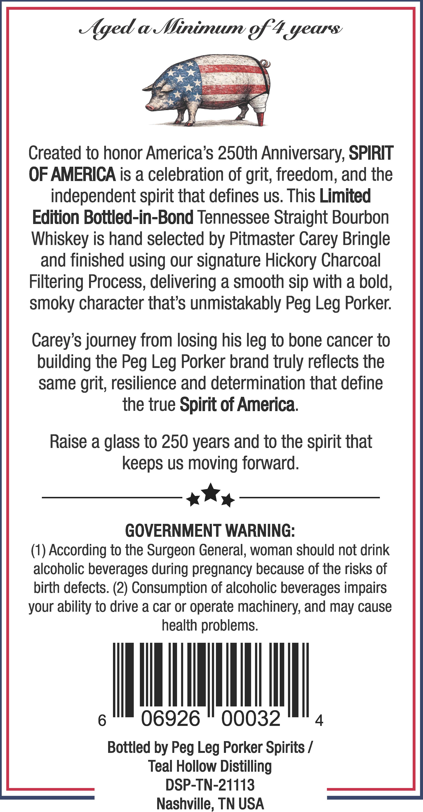

# TTB COLA Label Images - TTBID 26034001000488

**Brand Name:** PEG LEG PORKER

**Fanciful Name:** SPIRIT OF AMERICA

**Issue Date:** 02/09/2026

**Origin Code:** 43

**Product Class/Type:** 119

**Source:** [TTB Public COLA Registry](https://ttbonline.gov/colasonline/viewColaDetails.do?action=publicFormDisplay&ttbid=26034001000488)

## Label Images

### Back Label

### Front Label

## Extracted Label Text

*Text extracted via OCR - may contain errors*

### Back Label

Aged aVinimum o Years:

Created to honor America’s 250th Anniversary, SPIRIT

OF AMERICA is a celebration of grit, freedom, and the

independent spirit that defines us. This Limited

Edition Bottled-in-Bond Tennessee Straight Bourbon

Whiskey is hand selected by Pitmaster Carey Bringle

and finished using our signature Hickory Charcoal

Filtering Process, delivering a smooth sip with a bold,

smoky character that’s unmistakably Peg Leg Porker.

Carey’s journey from losing his leg to bone cancer to

building the Peg Leg Porker brand truly reflects the

same grit, resilience and determination that define

the true Spirit of America.

Raise a glass to 250 years and to the spirit that

keeps us moving forward.

1 Wy

GOVERNMENT WARNING:

(1) According to the Surgeon General, woman should not drink

alcoholic beverages during pregnancy because of the risks of

birth defects. (2) Consumption of alcoholic beverages impairs

your ability to drive a car or operate machinery, and may cause

health problems.

|

q

06926 © 00032

4

Bottled by Peg Leg Porker Spirits /

Teal Hollow Distilling

DSP-TN-21113

Nashville, TN USA

### Front Label

= =

Soe

SERS

Mok

Ses

ere

Te,

SN

ay

SS

<

See

SS OS

—

+

ef

Se

Ne

es

Se

SP

NY

Sh

S

X

=

y

'

\)

VSS

i

\y

v

\

ve

Res

jul

A

bil

aes

ne

ree

S\N

oe

i}

3)

Jy

tH,

"EX

Sane

“sy

Vb

——S—

ths

RZ

cosy

Ny

2)

ie

A

be

LZ

Ze:

4

RE

ik

Ss

~

we

a7

Wy)

aa

ne

<

B

“ihe

Ash

88

w

\Z

SS

Sy

fsa

os

————=

PEG LEG PORKER

.

+ Wy

foit-of, America

AMERICAS 250TH

BIRTHDAY

*

ey)

TENNESSEE STRAIT

GHT

‘inhos OW a

4

BOTTLED IN BON

790 ML

50% ALC/VOL (100 PROOF)
