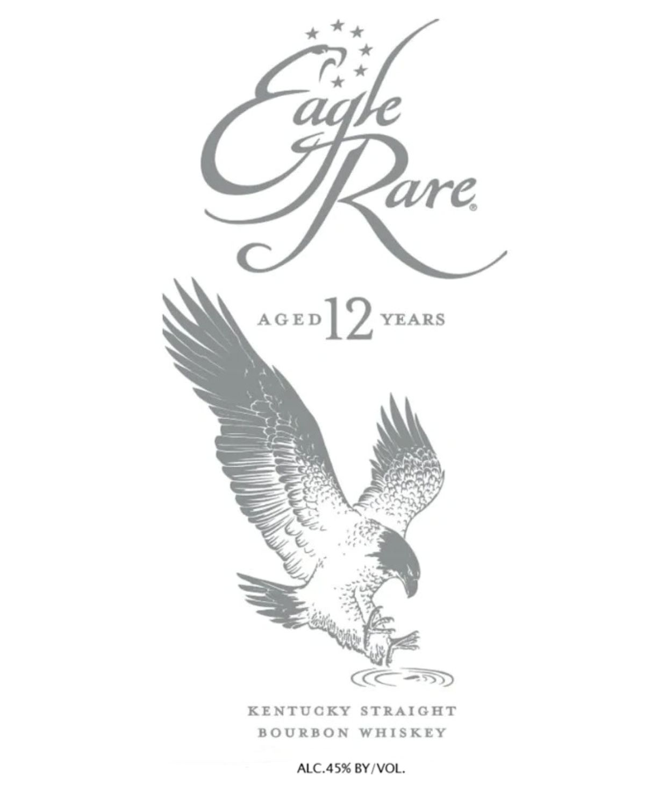
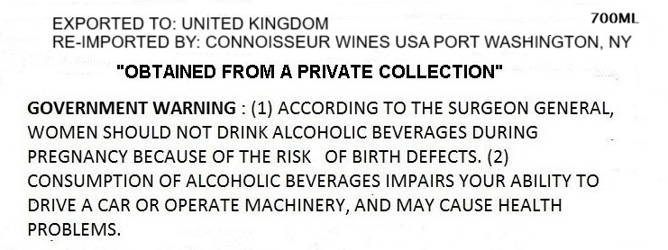

# TTB COLA Label Images - TTBID 26034001000618

**Brand Name:** EAGLE RARE

**Fanciful Name:** AGED 12 YEARS

**Issue Date:** 02/09/2026

**Origin Code:** 00

**Product Class/Type:** 101

**Source:** [TTB Public COLA Registry](https://ttbonline.gov/colasonline/viewColaDetails.do?action=publicFormDisplay&ttbid=26034001000618)

## Label Images

### Label 1

### Label 2

## Extracted Label Text

*Text extracted via OCR - may contain errors*

### Label 1

x **

ave.

acev]9 YEARS

Es

aS

x

"es

KOSSD

KENTUCKY STRAIGHT

BOURBON WHISKEY

ALC.45% BY/VOL.

### Label 2

700ML

EXPORTED TO: UNITED KINGDOM

RE-IMPORTED BY: CONNOISSEUR WINES USA PORT WASHINGTON, NY

“OBTAINED FROM A PRIVATE COLLECTION”

GOVERNMENT WARNING : (1) ACCORDING TO THE SURGEON GENERAL,

WOMEN SHOULD NOT DRINK ALCOHOLIC BEVERAGES DURING

PREGNANCY BECAUSE OF THE RISK OF BIRTH DEFECTS. (2)

CONSUMPTION OF ALCOHOLIC BEVERAGES IMPAIRS YOUR ABILITY TO

DRIVE A CAR OR OPERATE MACHINERY, AND MAY CAUSE HEALTH

PROBLEMS.
