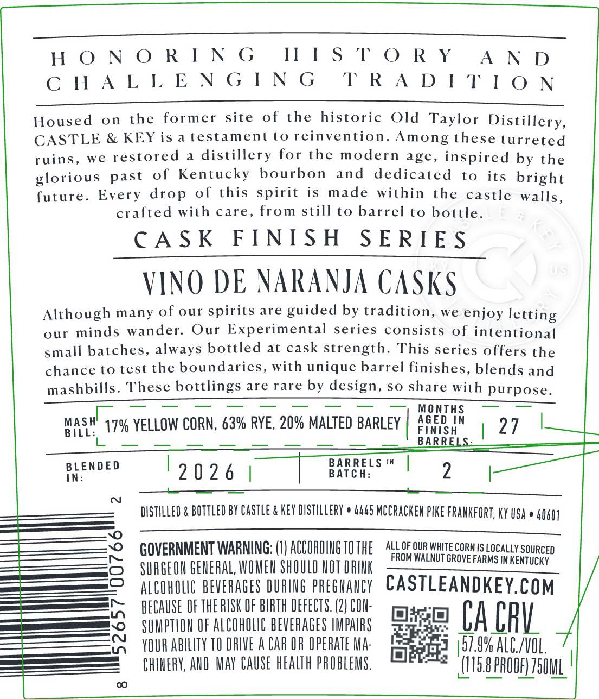
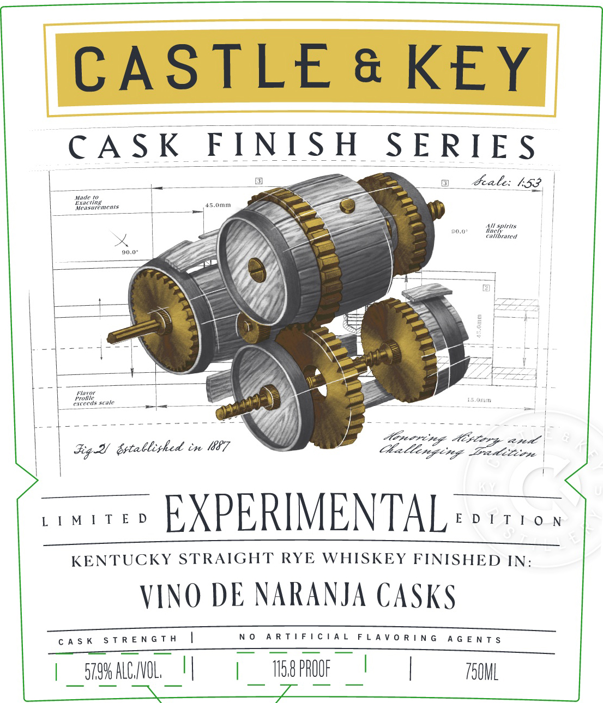

# TTB COLA Label Images - TTBID 26034001000722

**Brand Name:** CASTLE & KEY

**Fanciful Name:** CASK FINISH SERIES

**Issue Date:** 02/09/2026

**Origin Code:** 22

**Product Class/Type:** 102

**Source:** [TTB Public COLA Registry](https://ttbonline.gov/colasonline/viewColaDetails.do?action=publicFormDisplay&ttbid=26034001000722)

## Label Images

### Back Label

### Front Label

### Label 2

### Label 3

## Extracted Label Text

*Text extracted via OCR - may contain errors*

### Back Label

HISTORY

HONORING

AN D

CHALLENGING

TRADITION

Housed on the former site of the historic Old Taylor Distillery

CASTLE & KEY is a testament to reinvention Among these turreted

ruins, we restored a distillery for the modern age, inspired by the

glorious past of Kentucky bourbon and dedicated to its bright

future. Every drop of this spirit is made within the castle walls

crafted with care, from still to barrel to bottle

CASK FINISH SERIES

VINO DE NARANJA CASKS

Although many of our spirits are guided by tradition, we enjoy letting

our minds wander. Our Experimental series consists of intentional

small batches, always bottled at cask strength. This series offers the

chance to test the boundaries, with unique barrel finishes, blends and

mashbills. These bottlings are rare by design, so share with Purpose

masul

BILL:

a YELLOW CORN, 63% RYE, 20% MALTED BARLEY

heeo iN

Feuce

127 |

BLENDED

19026 |

BAT

BARRELS ™ |

2

|

—

_—

DISTILLED & BOTTLED BY CASTLE & KEY DISTILLERY © 4445 MCCRACKEN PIKE FRANKFORT, KY USA © 40401

GOVERNMENT WARNING: (I) ACCORDING TO THE a a OUR WHITE CORN IS LOCALLY SOURCED

IM WALNUT GROVE FARMS IN KENTUCKY

SURGEON GENERAL, WOMEN SHOULD NOT DRINK

ALCOHOLIC BEVERAGES OURING PREGNANCY CASTLEANDKEY.COM

BECAUSE OF THE RISK OF BIRTH DEFECTS. (2) CON-

SUMPTION OF ALCOHOLIC BEVERAGES IMPAIRS

CA CAV.

YOUR ABILITY TO DRIVE A CAR OR OPERATE MA-

ae

(57.9% ALC./VOL.

CHIWERY, AND MAY CAUSE HEALTH PROBLEMS.

ti O PROOF) 750ML

### Front Label

CASTLE & KEY

nena

NISH

Pi esensenes ele

_SERIES

re

Fale: 153.

90.0"

——

| [+

AZ

( hs

j

“2

oa

as

\Y

ee

Zz

———o

Airvorivage Hcy og lt

Fg aiepabitie E7

Malterging Bed irirse

~wuvee EXPERIMENTAL nos

KENTUCKY STRAIGHT RYE WHISKEY FINISHED IN:

VINO DE NARANJA CASKS

CASK STRENGTH |

——

O ARTIFICIAL FLAVORING AGENTS

|

TSOML

| srw ALGNOL. ||

| T8PROOF |

### Label 2

er

### Label 3

as

st

a

a

is

P- KY:

iiss

-

e

a
