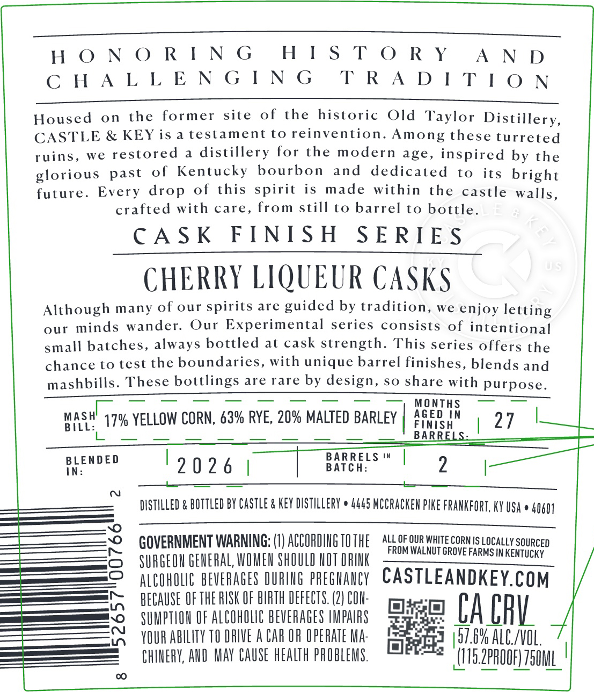
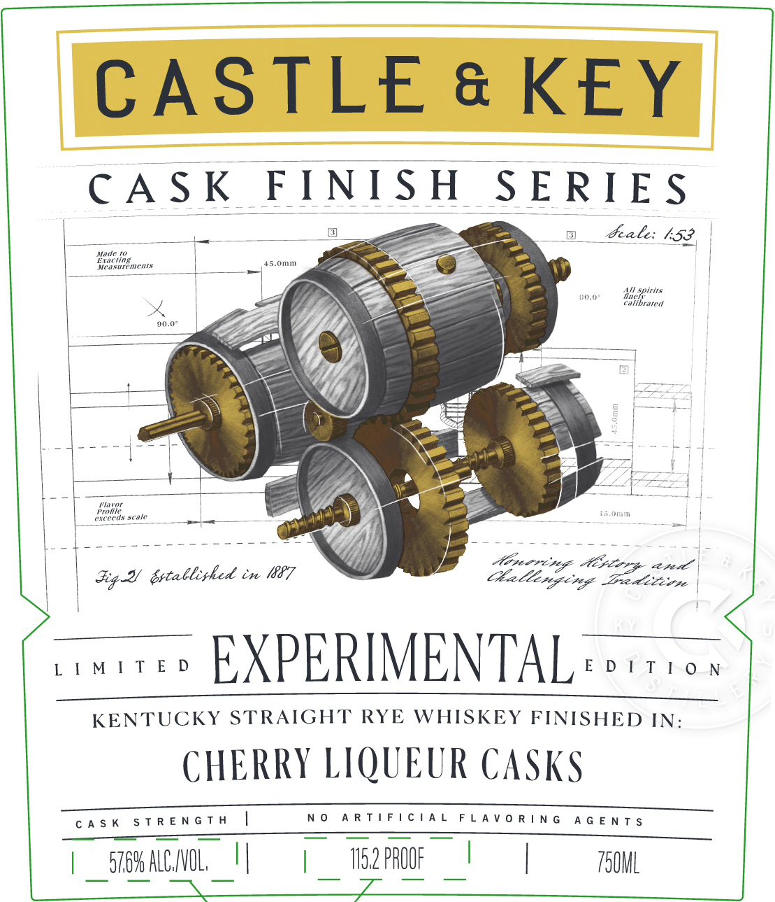
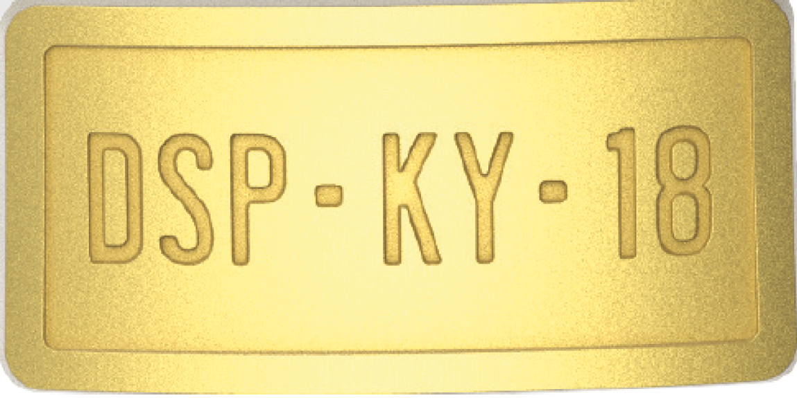

# TTB COLA Label Images - TTBID 26034001000723

**Brand Name:** CASTLE & KEY

**Fanciful Name:** CASK FINISH SERIES

**Issue Date:** 02/09/2026

**Origin Code:** 22

**Product Class/Type:** 102

**Source:** [TTB Public COLA Registry](https://ttbonline.gov/colasonline/viewColaDetails.do?action=publicFormDisplay&ttbid=26034001000723)

## Label Images

### Back Label

### Front Label

### Label 3

### Label 4

## Extracted Label Text

*Text extracted via OCR - may contain errors*

### Back Label

HI

STORY

HONORING

AND

CHALLENGING

TRADITION

Housed on the former site of the historic Old Taylor Distillery

CASTLE & KEY is a testament to reinvention. Among these turreted

ruins, we restored a distillery for the modern age, inspired by the

glorious past of Kentucky bourbon and dedicated to its bright

future. Every drop of this spirit is made within the castle walls,

crafted with care, from still to barrel to bottle.

CASK FINISH SERIES

CHERRY LIQUEUR CASKS

Although many of our spirits are guided by tradition, we enjoy letting

our minds wander. Our Experimental series consists of intentional

small batches, always bottled at cask strength. This series offers the

chance to test the boundaries, with unique barrel finishes, blends and

mashbills. These bottlings are rare by design, so share with purpose.

MO

masil

17% YELLOW CORN, 63% RYE, 20% MALTED BARLEY

AGED IN

INI

BILL:

B

AR

Ay

tLe

BLENDED

19026 |

puna |

2

|

——

—

DISTILLED & BOTTLED BY CASTLE & KEY DISTILLERY © 4445 MCCRACKEN PIKE FRANKFORT, KY USA © 40401

GOVERNMENT WARNING: (1) ACCORDING TOTHE 4.

ROM WALNUT GROVE FARMS IN KENTUCKY

OF OUR WHITE CORN IS LOCALLY SOURCED

SURGEON GENERAL, WOMEN SHOULD NOT DRINK

ALCOHOLIC BEVERAGES OURING PREGNANCY CASTLEANDKEY.COM

BECAUSE OF THE RISK OF BIRTH DEFECTS. (2) CON-

SUMPTION OF ALCOHOLIC BEVERAGES IMPAIRS

mise) [A CAV.

YOUR ABILITY TO DRIVE A CAR OF OPERATE MA-

1]

3 |57.6% ALC/VOL.

CHINERY, AND MAY CAUSE HEALTH PROBLEMS.

ee (IIS.ZPROOF) 750M

### Front Label

CASTLE & KEY

IISH SERIES

we ee eat

CASK Fl

1

Fale: 153

—

br

LIE

‘Yo

a

= aa

as

d

E

AY sets

\e

es

)

ae= Se

5%

bu

2, ee

| ; apt grtablizhed in 67

daltixging Bed iiirse

~uvee EXPERIMENTAL es

KENTUCKY STRAIGHT RYE WHISKEY FINISHED IN:

CHERRY LIQUEUR CASKS

CASK STRENGTH |

———

NO ARTIFICIAL FLAVORING AGENTS

|

TOML

| sreMALCNOL, |

| m2 PROOF |

### Label 3

as

st

a

a

is

P- KY:

iiss

-

e

a

### Label 4

er
