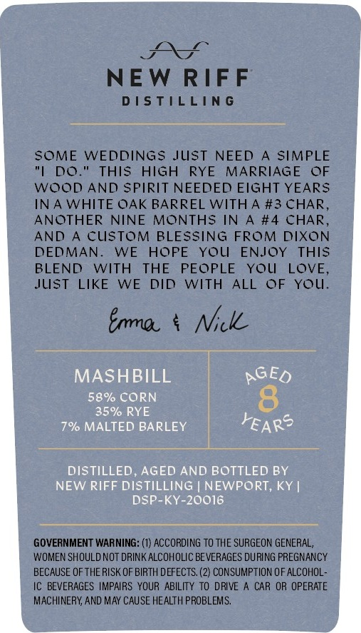
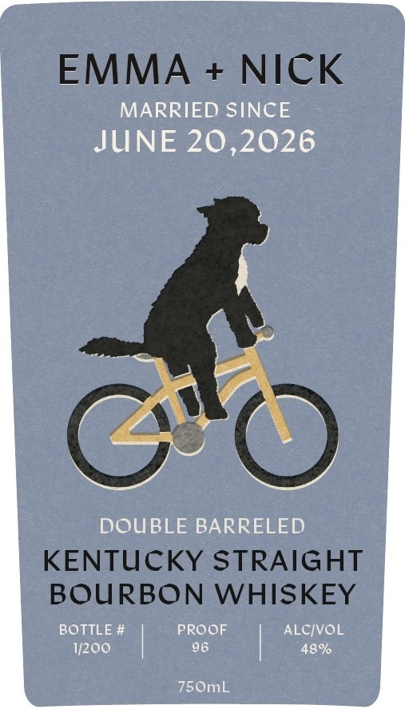

# TTB COLA Label Images - TTBID 26035001000048

**Brand Name:** EMMA + NICK

**Issue Date:** 02/09/2026

**Origin Code:** 22

**Product Class/Type:** 101

**Source:** [TTB Public COLA Registry](https://ttbonline.gov/colasonline/viewColaDetails.do?action=publicFormDisplay&ttbid=26035001000048)

## Label Images

### Back Label

### Front Label

## Extracted Label Text

*Text extracted via OCR - may contain errors*

### Back Label

NEW RIFF

DISTILLING

iiss ee

sates

SOME WEDDINGS JUST NEED A SIMPLE

"|

DO." THIS HIGH RYE MARRIAGE OF

WOOD AND SPIRIT NEEDED EIGHT YEARS

IN A WHITE OAK BARREL WITH A #3 CHAR,

ANOTHER NINE MONTHS IN A #4 CHAR,

AND A CUSTOM BLESSING FROM DIXON

DEDMAN. WE HOPE YOU

ENJOY THIS

BLEND WITH THE PEOPLE YOU

LOVE,

JUST LIKE WE DID WITH ALL OF YOU.

Page

bra. Se

pee Se

eae

MASHBILL

|

pSto

58% CORN

35% RYE

|

7% MALTED BARLEY

i

FEAR

soet

ss

ae eek

saa) BSERUS

|

a

DISTILLED, AGED AND BOTTLED BY

NEW RIFF DISTILLING | NEWPORT, KY |

DSP-KY-20016

—

GOVERNMENT WARNING: (1) ACCORDING TO THE SURGEON GENERAL,

WOMEN SHOULD NOT DRINK ALCOHOLIC BEVERAGES DURING PREGNANCY

BECAUSE OF THERISK OF BIRTH DEFECTS. (2) CONSUMPTION OF ALCOHOL-

IC BEVERAGES IMPAIRS YOUR ABILITY TO DRIVE A CAR OR OPERATE

MACHINERY, AND MAY CAUSE HEALTH PROBLEMS.

### Front Label

EMMA + NICK

MARRIED SINCE
JUNE 20,2026

DOUBLE BARRELED
KENTUCKY STRAIGHT
BOURBON WHISKEY

BOTTLE # PROOF ALC/VOL
1/200 96 48%

750mL
