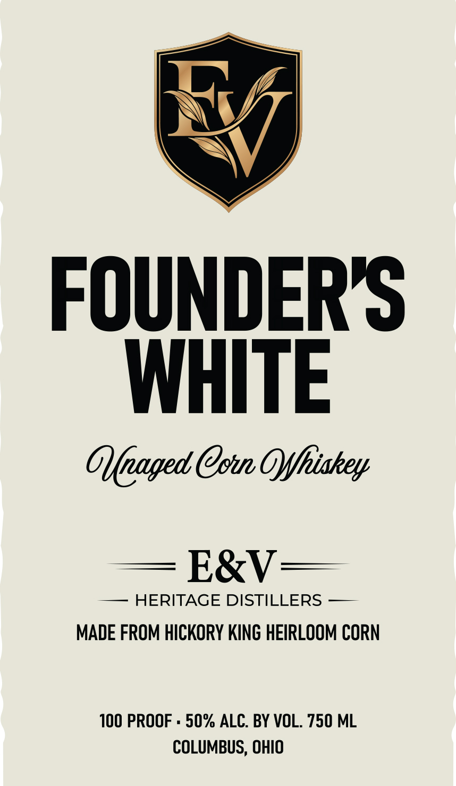
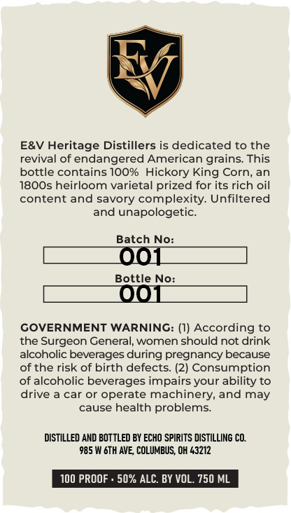

# TTB COLA Label Images - TTBID 26035001000056

**Brand Name:** E&V HERITAGE DISTILLERS

**Fanciful Name:** FOUNDER'S WHITE

**Issue Date:** 02/10/2026

**Origin Code:** 09

**Product Class/Type:** 143

**Source:** [TTB Public COLA Registry](https://ttbonline.gov/colasonline/viewColaDetails.do?action=publicFormDisplay&ttbid=26035001000056)

## Label Images

### Front Label

### Label 2

## Extracted Label Text

*Text extracted via OCR - may contain errors*

### Front Label

FOUNDER'S
WHITE

Oleaged Con Offldahey

— HERITAGE DISTILLERS —
MADE FROM HICKORY KING HEIRLOOM CORN

100 PROOF - 50% ALC. BY VOL. 750 ML
COLUMBUS, OHIO

### Label 2

E&V Heritage Distillers is dedicated to the

revival of endangered American grains. This

bottle contains 100% Hickory King Corn, an

1800s heirloom varietal prized for its rich oil

content and savory complexity. Unfiltered
and unapologetic.

Batch No:

Bottle No:

GOVERNMENT WARNING: (1) According to

the Surgeon General, women should not drink

alcoholic beverages during pregnancy because

of the risk of birth defects. (2) Consumption

of alcoholic beverages impairs your ability to

drive a car or operate machinery, and may
cause health problems.

DISTILLED AND BOTTLED BY ECHO SPIRITS DISTILLING CO.
‘985 W 6TH AVE, COLUMBUS, OH 43212

100 PROO!

50% Al

3Y VOL. 750 ML
