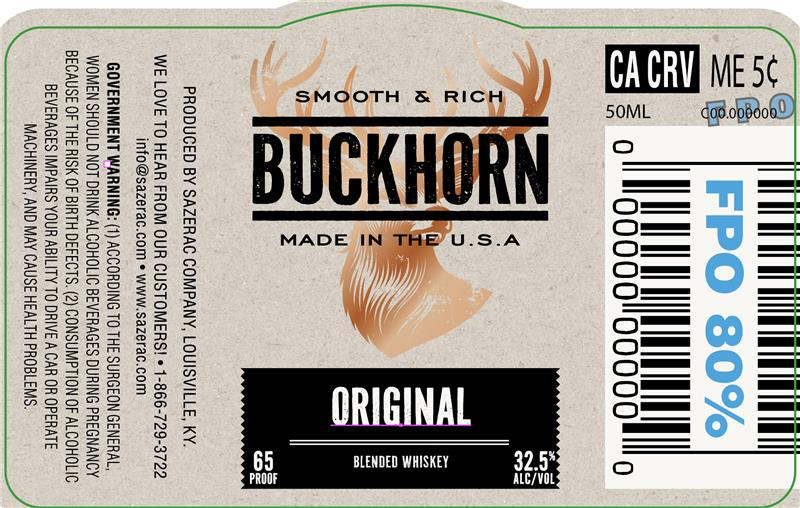

# TTB COLA Label Images - TTBID 26035001000080

**Brand Name:** BUCKHORN

**Fanciful Name:** ORIGINAL

**Issue Date:** 02/09/2026

**Origin Code:** 22

**Product Class/Type:** 137

**Source:** [TTB Public COLA Registry](https://ttbonline.gov/colasonline/viewColaDetails.do?action=publicFormDisplay&ttbid=26035001000080)

## Label Images

### Label 1

## Extracted Label Text

*Text extracted via OCR - may contain errors*

### Label 1

CA CRVENiaaxe

SMOOTH & RIC

50ML

Bo

UGK

o=

Oo==

MADE I

U.S.A

o_

o=_

o_—

(/

o==

o™==

o™

o=™

ORIGINAL

om

x

5

BLENDED WHISKEY

32.5%

PROOF

ALC/VOL
