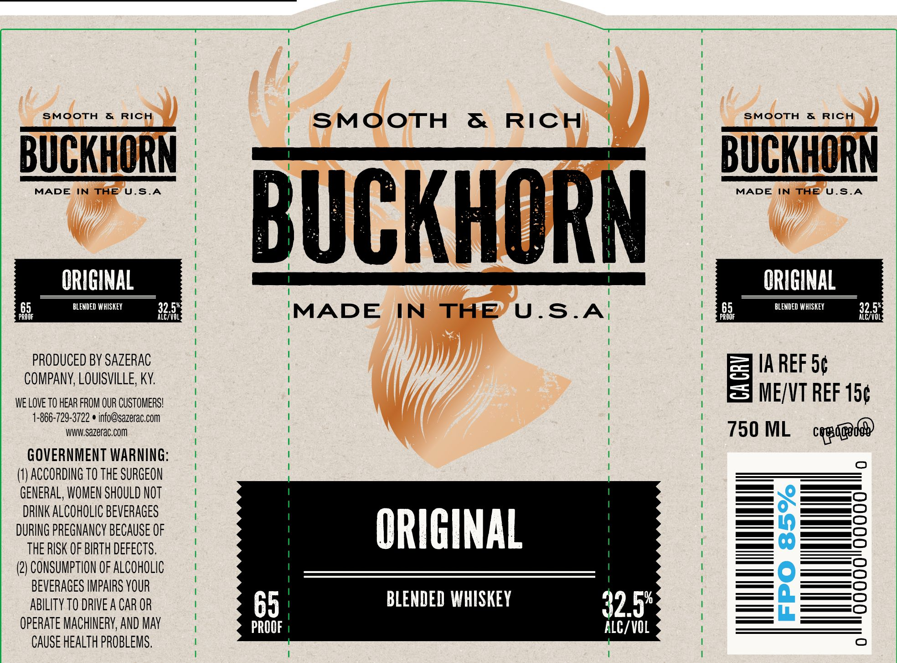

# TTB COLA Label Images - TTBID 26035001000082

**Brand Name:** BUCKHORN

**Fanciful Name:** ORIGINAL

**Issue Date:** 02/09/2026

**Origin Code:** 22

**Product Class/Type:** 137

**Source:** [TTB Public COLA Registry](https://ttbonline.gov/colasonline/viewColaDetails.do?action=publicFormDisplay&ttbid=26035001000082)

## Label Images

### Label 1

## Extracted Label Text

*Text extracted via OCR - may contain errors*

### Label 1

SMOOTH & RICH

SMOOTH & RICH

td

SMOOTH & RICH

j |

BUCKHORN

BUCKHORN

MADE IN THE ‘U S.A

MADE IN MADE INTHE USA U.S.A

|

"dd

BUCKHOR

ORIGINAL

ORIGINAL

BLENDED WHISKEY

32.5%

5

BLENDED WHISKEY

32.5%

PROOF

ALC/VOL

PROOF

ALC/VOL:

MADE IN THE U.S.A

Wy)

PRODUCED BY SAZERAC

]

IA REF 5¢

COMPANY, LOUISVILLE, KY.

WE LOVE TO HEAR FROM OUR CUSTOMERS!

[/

ME/VT REF 15¢

1-866-729-3722  info@sazerac.com

WWW.sazerac.com

J

750 ML cypsgnde

GOVERNMENT WARNING

(1) ACCORDING T0 THE SURGEON

GENERAL, WOMEN SHOULD NOT

es

DRINK ALCOHOLIC BEVERAGES

DURING PREGNANCY BECAUSE OF

THE RISK OF BIRTH DEFECTS

ORIGINAL

—

——O

(2) CONSUMPTION OF ALCOHOLIC

————O

BEVERAGES IMPAIRS YOUR

—(_)

———O

ABILITY TO DRIVE A CAR OR

65

BLENDED WHISKEY

——=C)

OPERATE MACHINERY, AND MAY

PROOF |

32.5%

CAUSE HEALTH PROBLEMS

ALC/VOL
