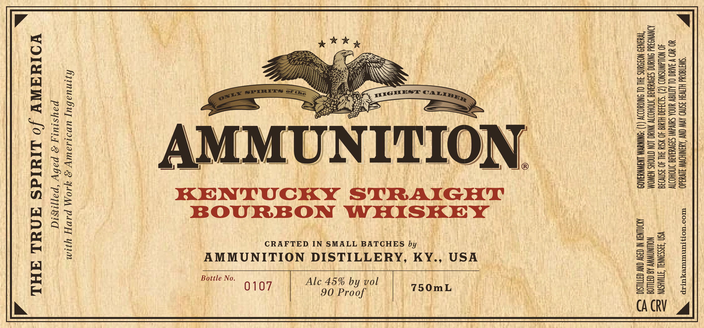

# TTB COLA Label Images - TTBID 26035001000156

**Brand Name:** AMMUNITION

**Fanciful Name:** KENTUCKY STRAIGHT BOURBON WHISKEY

**Issue Date:** 02/17/2026

**Origin Code:** 43

**Product Class/Type:** 101

**Source:** [TTB Public COLA Registry](https://ttbonline.gov/colasonline/viewColaDetails.do?action=publicFormDisplay&ttbid=26035001000156)

## Label Images

### Label 1

## Extracted Label Text

*Text extracted via OCR - may contain errors*

### Label 1

W “SWATGON HLTVGH 3SNV9 AVW CNY AXSNIKDWW SIVYR40 -— WrOo"NomsrMuTuTexTEp “
YO UD V IAUO OL ALTIGV UNDA SdIvalNl S3OVUIAIE IMOHODTV

40 WOUAWNSNOD (2) "S1o3430-HIG 40 NStd 3AL 40 aSn\038 VSN S3SSHNNAL TTIAHSYN =

JONYNS 4d ONIANC SIVUAATE STOHOOIW YNINC LON CINGHS NAWOM NOWNAWWY AB CHLLOG $=

“TWHHN9:NOOUNS 3HL OL ONIOYODDV (1) -ONINAVM LNGWNY3K09 MONEY NOY ON CATS. SS

ON.

>

CRAFTED IN SMALL BATCHES by

AMMUNITION DISTILLERY, KY

Bottle No.

ys
ia
Ne
0)
Z
:
:
Q
pa

2
v
:
Bs
H
0)
by
3
0
fs
|
Z
Ee
Hs

AM

hjinuabuy uvs1sauy 2 YlOM PAVE] yum
paysiuty 2 paby “pappisid
VOINAWY /o LIYIdS ANUL AML 3
