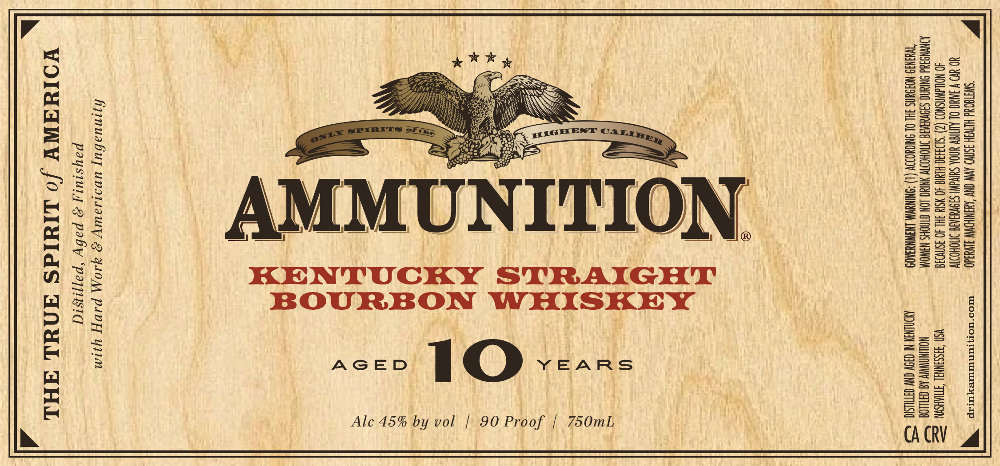

# TTB COLA Label Images - TTBID 26035001000163

**Brand Name:** AMMUNITION

**Fanciful Name:** KENTUCKY STRAIGHT BOURBON WHISKEY
10 YEAR

**Issue Date:** 02/13/2026

**Origin Code:** 43

**Product Class/Type:** 100

**Source:** [TTB Public COLA Registry](https://ttbonline.gov/colasonline/viewColaDetails.do?action=publicFormDisplay&ttbid=26035001000163)

## Label Images

### Label 1

### Label 2

## Extracted Label Text

*Text extracted via OCR - may contain errors*

### Label 1

W “SWATGON HLTVGH 3SNV0 AVW CNY AGNEW SIVYz40 — WrOo"NorsrnuTurex Trp “
YO UD V IAUC OL ALTIGY UNDA SuivalNl S3OVUIASE JMOHODTY

40 NOUAWNSNOD (2) "SIo3430-HIG 40 NStd 3HL 40 Sn\O38 VSN S3SSHNNAL TTIAHSYN Ee

JONYNS Add SNIANC SISVUVTE SOHO YNINC LON CTNCHS NAWOM NOWNAWWY AB CHILOG $=

“TAIN9: NOROANS 3HL OL ONIOYODDY (1) -ONINVM LNGWNYSKO9 MONEY NOY ON TUSK. SS

[UNITION.

Alc 45% by vol | 90 Proof | 750mL,

ys
ia
Ne
0)
Z
:
:
Q
pa

2
v
:
Bs
H
0)
by
=
0
fs
|
Z
Ee
Hs

AM

hjinuabuy uvs1sauy 2 ALO PAVE] yq1Mm
paysiuty 2 paby “papjisid
VOINAWY /o LIYIdS ANUL AML 3

### Label 2

sy)

(a © om SS (tiie © oe SZ) Y fie

VU0] 0000000007000 CT CTT CE CETTE CETTE CETTE CTE EET Eee eee EEE TEE

——

PRODUCED IN SMALL BATCHES

4

WITH ZERO B.S.

PULP LEEPLA ELLE LULU TELUR UL TUAUO PULP TROLL OO

PO SEMEL PO} a 4
